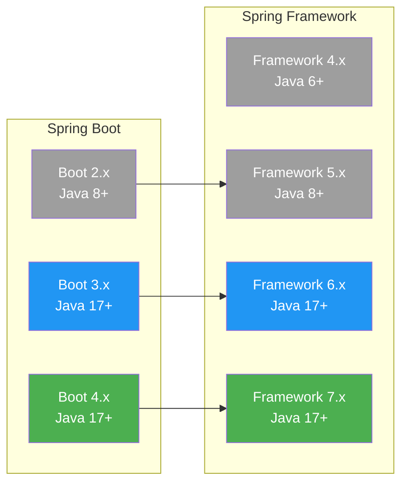

# Spring Release Notes (한국어)

Spring Framework와 Spring Boot의 버전별 릴리즈 노트를 한국어로 정리한 문서 모음입니다.
초보 개발자도 쉽게 이해할 수 있도록 상세한 설명과 코드 예제를 포함하고 있습니다.

---

## Spring Framework

Spring Framework는 Java 엔터프라이즈 애플리케이션 개발의 핵심 프레임워크입니다.

| 시리즈 | 버전 | 상태 |
|--------|------|------|
| [7.x](spring-framework/7.x/) | 7.0 | 최신 |
| [6.x](spring-framework/6.x/) | 6.0 ~ 6.2 | 유지보수 |
| [5.x](spring-framework/5.x/) | 5.0 ~ 5.3 | EOL |
| [4.x](spring-framework/4.x/) | 4.0 ~ 4.3 | EOL |

> [Spring Framework 전체 버전 히스토리 보기](spring-framework/README.md)

---

## Spring Boot

Spring Boot는 Spring 기반 애플리케이션을 빠르게 만들 수 있게 해주는 도구입니다.

| 시리즈 | 버전 | 상태 |
|--------|------|------|
| [4.x](spring-boot/4.x/) | 4.0 | 최신 |
| [3.x](spring-boot/3.x/) | 3.0 ~ 3.5 | 유지보수 |
| [2.x](spring-boot/2.x/) | 2.0 ~ 2.7 | EOL |

> [Spring Boot 전체 버전 히스토리 보기](spring-boot/README.md)

---

## 마이그레이션 가이드

메이저 버전 업그레이드 시 참고할 수 있는 마이그레이션 가이드입니다.

### Spring Framework
- [4.x → 5.x 마이그레이션](migration-guides/spring-framework-4to5.md)
- [5.x → 6.x 마이그레이션](migration-guides/spring-framework-5to6.md)
- [6.x → 7.x 마이그레이션](migration-guides/spring-framework-6to7.md)

### Spring Boot
- [2.x → 3.x 마이그레이션](migration-guides/spring-boot-2to3.md)
- [3.x → 4.x 마이그레이션](migration-guides/spring-boot-3to4.md)

> [마이그레이션 가이드 전체 목차](migration-guides/README.md)

---

## 버전 호환성 요약

> 초록: 최신 / 파랑: 유지보수 / 회색: EOL(지원 종료)

---

## 이 프로젝트에 대해

- 모든 문서는 공식 릴리즈 노트와 Spring 블로그를 기반으로 작성되었습니다.
- Mermaid 다이어그램을 활용하여 아키텍처와 처리 흐름을 시각적으로 설명합니다.
- 오류나 개선 사항은 Issue로 알려주세요.
