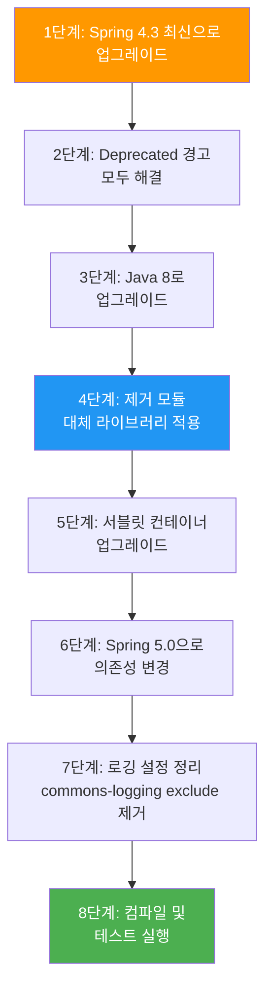

# Spring Framework 4.x → 5.x 마이그레이션 가이드

| 항목 | Spring Framework 4.x | Spring Framework 5.x |
|------|----------------------|----------------------|
| **Java 버전** | Java 6+ | **Java 8+** |
| **Java EE** | Java EE 6~7 | **Java EE 7~8** |
| **Servlet** | Servlet 2.5~3.1 | **Servlet 3.1~4.0** |
| **Tomcat** | 6.0+ | **8.5+** |
| **Jetty** | 7.0+ | **9.4+** |
| **난이도** | | **중간** |

---

## 개요

Spring Framework 5.0은 **Java 8을 최소 기준선**으로 채택한 첫 번째 메이저 버전입니다. 람다, 스트림, Optional 등 Java 8 API를 전면 활용하며, 리액티브 프로그래밍을 위한 **WebFlux**가 새로 도입되었습니다. 여러 레거시 모듈(Portlet, Velocity 등)이 제거되었으므로, 해당 모듈 사용 여부를 먼저 확인하세요.

---

## 사전 준비 체크리스트

- [ ] 현재 프로젝트가 Spring Framework **4.3 최신 버전**인지 확인
- [ ] 모든 `@Deprecated` 경고를 해결
- [ ] Java 8 이상 설치 및 소스/타겟 레벨 변경
- [ ] 제거 대상 모듈(Portlet, Velocity 등) 사용 여부 확인
- [ ] Guava Cache 사용 여부 확인 (Caffeine으로 전환 필요)
- [ ] 서블릿 컨테이너를 Servlet 3.1+ 호환 버전으로 업그레이드
- [ ] 기존 테스트 코드가 모두 통과하는지 확인

---

## 호환되지 않는 변경사항

### 1. Java 8 필수 — 람다/스트림 활용

```java
// Before (Java 6/7 스타일)
List<String> names = new ArrayList<>();
for (User user : users) {
    if (user.isActive()) {
        names.add(user.getName());
    }
}

// After (Java 8 스트림)
List<String> names = users.stream()
    .filter(User::isActive)
    .map(User::getName)
    .collect(Collectors.toList());
```

### 2. Guava Cache → Caffeine Cache

Spring 5.0에서 Guava Cache 지원이 제거되었습니다. Caffeine은 Guava Cache의 후속 라이브러리입니다.

```java
// Before (Guava Cache)
@Bean
public CacheManager cacheManager() {
    GuavaCacheManager manager = new GuavaCacheManager("users");
    manager.setCacheBuilder(CacheBuilder.newBuilder()
        .maximumSize(100)
        .expireAfterWrite(10, TimeUnit.MINUTES));
    return manager;
}

// After (Caffeine Cache)
@Bean
public CacheManager cacheManager() {
    CaffeineCacheManager manager = new CaffeineCacheManager("users");
    manager.setCaffeine(Caffeine.newBuilder()
        .maximumSize(100)
        .expireAfterWrite(10, TimeUnit.MINUTES));
    return manager;
}
```

```groovy
// build.gradle 의존성 변경
// Before
implementation 'com.google.guava:guava:x.x'

// After
implementation 'com.github.ben-manes.caffeine:caffeine:2.6+'
```

### 3. `commons-logging` → `spring-jcl` 자동 브릿지

```xml
<!-- Before (Spring 4.x) — 수동 exclude + bridge 필요 -->
<dependency>
    <groupId>org.springframework</groupId>
    <artifactId>spring-core</artifactId>
    <exclusions>
        <exclusion>
            <groupId>commons-logging</groupId>
            <artifactId>commons-logging</artifactId>
        </exclusion>
    </exclusions>
</dependency>
<dependency>
    <groupId>org.slf4j</groupId>
    <artifactId>jcl-over-slf4j</artifactId>
</dependency>

<!-- After (Spring 5.x) — spring-jcl이 자동 브릿지 -->
<dependency>
    <groupId>org.springframework</groupId>
    <artifactId>spring-core</artifactId>
    <!-- exclude 불필요! spring-jcl이 SLF4J/Log4j2 자동 감지 -->
</dependency>
```

### 4. CORS 설정 기본값 변경

```java
// Before (4.x) — allowCredentials 기본값 true
@CrossOrigin
@GetMapping("/api/data")
public Data getData() { ... }

// After (5.0) — allowCredentials 기본값 false, 명시적 설정 필요
@CrossOrigin(allowCredentials = "true")
@GetMapping("/api/data")
public Data getData() { ... }
```

---

## API 변경사항

| 변경 항목 | 설명 |
|----------|------|
| `AsyncRestTemplate` | Deprecated → `WebClient` 사용 권장 |
| 함수형 빈 등록 | `GenericApplicationContext.registerBean()` 추가 |
| JUnit 5 지원 | `SpringExtension`, `@SpringJUnitConfig` 추가 |
| `WebClient` | 리액티브 HTTP 클라이언트 신규 도입 |
| Kotlin 지원 | Null-safe API, 확장 함수, DSL 지원 |

---

## 설정 변경사항

### build.gradle 의존성 변경

```groovy
// Before (Spring 4.x)
dependencies {
    implementation 'org.springframework:spring-webmvc:4.3.x'
    implementation 'org.hibernate:hibernate-core:4.x'    // Hibernate 4 지원
}

// After (Spring 5.x)
dependencies {
    implementation 'org.springframework:spring-webmvc:5.0.x'
    implementation 'org.hibernate:hibernate-core:5.0+'   // Hibernate 5 필수
}
```

### FreeMarker 설정 변경

Spring 5.0에서 FreeMarker는 HTML 출력 포맷팅이 필수입니다.

```properties
# application.properties
spring.freemarker.settings.output_format=HTMLOutputFormat
```

---

## 폐기 및 제거 항목

| 제거된 모듈/기능 | 대체 방안 |
|----------------|----------|
| **Portlet 지원** | Spring MVC 사용 |
| **Velocity 지원** | Thymeleaf 또는 FreeMarker |
| **JasperReports 지원** | 별도 라이브러리 직접 통합 |
| **XMLBeans 지원** | JAXB 또는 Jackson XML |
| **JDO 지원** | JPA 사용 |
| **Guava Cache** | Caffeine Cache |
| `orm.hibernate3` / `orm.hibernate4` | Hibernate 5 사용 |
| `web.view.tiles2` | Tiles 3 이상 |
| `jdbc.support.nativejdbc` | JDBC 4 네이티브 unwrap |

---

## 단계별 마이그레이션 절차



1. **Spring 4.3 최신 업그레이드**: 4.3은 4.x의 마지막 마이너 버전으로, 5.0 마이그레이션 준비에 최적입니다.
2. **Deprecated 해결**: 4.3에서 deprecated된 API는 5.0에서 제거됩니다.
3. **Java 8 업그레이드**: JDK 8 이상 설치 후 소스/타겟 레벨을 1.8로 설정합니다.
4. **제거 모듈 대체**: Portlet, Velocity, Guava Cache 등 사용 여부를 확인하고 대체합니다.
5. **서블릿 컨테이너 업그레이드**: Tomcat 8.5+, Jetty 9.4+ 등으로 업그레이드합니다.
6. **Spring 5.0 의존성 변경**: `build.gradle`/`pom.xml`에서 Spring 버전을 5.0으로 변경합니다.
7. **로깅 설정 정리**: `commons-logging` exclude와 `jcl-over-slf4j` 설정을 제거합니다(spring-jcl이 자동 처리).
8. **테스트 실행**: 전체 빌드 및 테스트를 실행하여 문제를 확인합니다.

---

## 자주 발생하는 문제 및 해결

**Q: Velocity 템플릿 엔진을 사용 중입니다. 어떻게 전환하나요?**
A: Thymeleaf 또는 FreeMarker로 전환하세요. Velocity는 5.0에서 완전히 제거되었으며, 대체 모듈이 제공되지 않습니다.

**Q: `commons-logging` 관련 설정은 어떻게 하나요?**
A: Spring 5.0부터 `spring-jcl`이 `spring-core`에 포함되어 SLF4J, Log4j 2, JUL을 자동 감지합니다. 기존의 `commons-logging` exclude 설정과 `jcl-over-slf4j` 의존성을 제거하면 됩니다.

**Q: WebFlux로 반드시 전환해야 하나요?**
A: 아닙니다. WebFlux는 **선택사항**입니다. 기존 Spring MVC 기반 프로젝트는 그대로 사용할 수 있습니다. WebFlux는 높은 동시성이 필요한 새로운 프로젝트에서 고려하세요.

**Q: JUnit 4 테스트를 JUnit 5로 바꿔야 하나요?**
A: 즉시 바꿀 필요는 없습니다. Spring 5.x는 JUnit 4와 5를 모두 지원합니다. 다만 JUnit 5의 `SpringExtension`을 사용하면 더 간결한 테스트 작성이 가능합니다.

---

## 참고 자료

- [Upgrading to Spring Framework 5.x (공식 위키)](https://github.com/spring-projects/spring-framework/wiki/Upgrading-to-Spring-Framework-5.x)
- [What's New in Spring Framework 5.x](https://github.com/spring-projects/spring-framework/wiki/What%27s-New-in-Spring-Framework-5.x)
- [Spring Framework 4.x 릴리즈 노트](../spring-framework/4.x/)
- [Spring Framework 5.x 릴리즈 노트](../spring-framework/5.x/)
- [Spring Framework 5→6 마이그레이션 가이드](spring-framework-5to6.md) (다음 단계)
