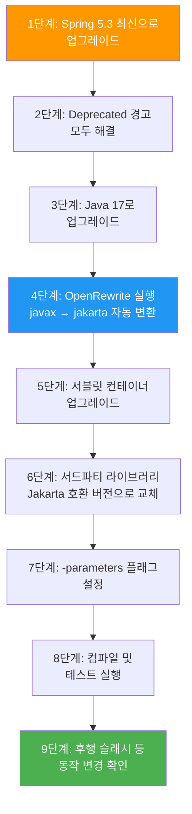

# Spring Framework 5.x → 6.x 마이그레이션 가이드

| 항목 | Spring Framework 5.x | Spring Framework 6.x |
|------|----------------------|----------------------|
| **Java 버전** | Java 8+ | **Java 17+** |
| **Jakarta EE** | Java EE 7~8 (`javax.*`) | **Jakarta EE 9+** (`jakarta.*`) |
| **Servlet** | Servlet 3.1~4.0 | **Servlet 5.0~6.0** |
| **Tomcat** | 8.5~9.x | **10~10.1+** |
| **Jetty** | 9.4+ | **11+** |
| **난이도** | | **높음** |

---

## 개요

Spring Framework 5.x에서 6.x로의 마이그레이션은 **역대 가장 큰 변경**입니다. 가장 핵심적인 변경은 `javax.*` 패키지가 `jakarta.*`로 전면 전환된 것이며, Java 기준선이 17로 상향되었습니다. 대부분의 프로젝트에서 광범위한 코드 수정이 필요하므로, OpenRewrite 같은 자동화 도구 활용을 강력히 권장합니다.

---

## 사전 준비 체크리스트

- [ ] 현재 프로젝트가 Spring Framework **5.3 최신 버전**인지 확인
- [ ] 모든 `@Deprecated` 경고를 해결
- [ ] Java 17 이상 설치 및 프로젝트 소스/타겟 레벨 변경
- [ ] 서블릿 컨테이너를 Jakarta EE 9+ 호환 버전으로 업그레이드 계획 수립
- [ ] `-parameters` 컴파일러 플래그 설정 (6.1부터 필수)
- [ ] 기존 테스트 코드가 모두 통과하는지 확인
- [ ] 사용 중인 서드파티 라이브러리의 Jakarta EE 호환 버전 확인

---

## 호환되지 않는 변경사항

### 1. `javax.*` → `jakarta.*` 패키지 전환 (가장 중요)

모든 Java EE 관련 패키지가 Jakarta EE 네임스페이스로 변경되었습니다.

```java
// Before (Spring 5.x)
import javax.servlet.http.HttpServletRequest;
import javax.persistence.Entity;
import javax.validation.Valid;
import javax.annotation.PostConstruct;

// After (Spring 6.x)
import jakarta.servlet.http.HttpServletRequest;
import jakarta.persistence.Entity;
import jakarta.validation.Valid;
import jakarta.annotation.PostConstruct;
```

### 2. 후행 슬래시(Trailing Slash) 매칭 기본 비활성화

```java
// Before: "/users"와 "/users/" 모두 매칭
@GetMapping("/users")
public List<User> getUsers() { ... }

// After: "/users/"는 404 반환
// 기존 동작 복원이 필요하면:
@Configuration
public class WebConfig implements WebMvcConfigurer {
    @Override
    public void configurePathMatch(PathMatchConfigurer configurer) {
        configurer.setUseTrailingSlashMatch(true);
    }
}
```

### 3. `ListenableFuture` → `CompletableFuture`

```java
// Before (Spring 5.x)
ListenableFuture<String> future = asyncService.execute();
future.addCallback(
    result -> log.info("성공: {}", result),
    ex -> log.error("실패", ex)
);

// After (Spring 6.x)
CompletableFuture<String> future = asyncService.execute();
future.thenAccept(result -> log.info("성공: {}", result))
      .exceptionally(ex -> { log.error("실패", ex); return null; });
```

---

## API 변경사항

| 변경 항목 | 설명 |
|----------|------|
| `HttpMethod` | 열거형(enum)에서 클래스로 변경 → `EnumSet` 사용 불가, `Set.of()` 사용 |
| `@Async` 반환 타입 | 반드시 `void` 또는 `Future` 반환 필요 (다른 타입은 예외 발생) |
| Bean Introspection | `java.beans.Introspector` 기본 미사용으로 변경 |
| JDBC 예외 번역 | `SQLExceptionSubclassTranslator`가 기본값으로 변경 |
| `ParameterNamesModule` | Jackson에서 자동 등록 (추가 `@JsonCreator`/`@JsonProperty` 필요할 수 있음) |

---

## 설정 변경사항

### build.gradle 의존성 변경

```groovy
// Before (Spring 5.x)
dependencies {
    implementation 'org.springframework:spring-webmvc:5.3.x'
    implementation 'org.hibernate:hibernate-core:5.6.x'
    implementation 'org.hibernate.validator:hibernate-validator:6.x'
}

// After (Spring 6.x)
dependencies {
    implementation 'org.springframework:spring-webmvc:6.0.x'
    implementation 'org.hibernate.orm:hibernate-core:6.1+'      // 또는 hibernate-core-jakarta (5.6.x)
    implementation 'org.hibernate.validator:hibernate-validator:7.0+'  // jakarta.validation
}
```

### `-parameters` 컴파일러 플래그 (6.1부터 필수)

```groovy
// Gradle
tasks.withType(JavaCompile).configureEach {
    options.compilerArgs.add("-parameters")
}
```

```xml
<!-- Maven -->
<plugin>
    <groupId>org.apache.maven.plugins</groupId>
    <artifactId>maven-compiler-plugin</artifactId>
    <configuration>
        <parameters>true</parameters>
    </configuration>
</plugin>
```

---

## 폐기 및 제거 항목

| 제거된 기능 | 대체 방안 |
|------------|----------|
| RPC 리모팅 (Hessian, HTTP Invoker, JMS Invoker, JAX-WS) | REST/메시징 기반 전환 |
| EJB 접근 지원 | 직접 Jakarta EE API 사용 |
| Joda-Time 포매팅 | `java.time` API |
| Apache Tiles | Thymeleaf, FreeMarker |
| Ehcache 2.x | Ehcache 3+ (`org.ehcache:ehcache` jakarta classifier) |
| JCA CCI 지원 | 개별 데이터 접근 API |
| Commons FileUpload | Servlet 3.0+ 표준 멀티파트 |
| Apache HttpClient 4.x | Apache HttpClient 5.x |

---

## 단계별 마이그레이션 절차



### OpenRewrite 자동 마이그레이션

```groovy
// build.gradle
plugins {
    id("org.openrewrite.rewrite") version("latest.release")
}

rewrite {
    activeRecipe("org.openrewrite.java.spring.framework.UpgradeSpringFramework_6_0")
}

dependencies {
    rewrite("org.openrewrite.recipe:rewrite-spring:latest.release")
}
```

실행: `gradle rewriteRun` 또는 `mvn rewrite:run`

---

## 자주 발생하는 문제 및 해결

**Q: `javax.*` import를 모두 수동으로 바꿔야 하나요?**
A: 아닙니다. OpenRewrite의 `JavaxMigrationToJakarta` 레시피를 사용하면 자동 변환됩니다. IDE의 전체 치환 기능도 활용할 수 있지만, OpenRewrite가 더 안전합니다.

**Q: 후행 슬래시(`/users/`)로 접근하면 404가 발생합니다.**
A: 6.0부터 후행 슬래시 매칭이 기본 비활성화되었습니다. `WebMvcConfigurer`에서 `setUseTrailingSlashMatch(true)`를 설정하거나, 클라이언트 측 URL을 수정하세요.

**Q: `@RequestParam` 등에서 파라미터 이름을 인식하지 못합니다.**
A: 6.1부터 `-parameters` 컴파일러 플래그가 필수입니다. 빌드 도구 설정에 플래그를 추가하고, IDE에서도 동일하게 설정하세요.

**Q: `ListenableFuture`를 사용하는 코드가 많습니다.**
A: 6.0에서 deprecated, 6.1에서 제거됩니다. `CompletableFuture`로 전환하세요. 콜백 패턴은 `thenAccept()`/`exceptionally()`로 대체됩니다.

**Q: Hibernate 버전을 어떻게 맞춰야 하나요?**
A: Hibernate ORM 6.1+을 사용하거나, 과도기적으로 Hibernate 5.6.x의 `hibernate-core-jakarta` 아티팩트를 사용할 수 있습니다.

---

## 참고 자료

- [Upgrading to Spring Framework 6.x (공식 위키)](https://github.com/spring-projects/spring-framework/wiki/Upgrading-to-Spring-Framework-6.x)
- [Spring Framework 6.0 릴리즈 노트](https://github.com/spring-projects/spring-framework/wiki/Spring-Framework-6.0-Release-Notes)
- [OpenRewrite - Spring Framework 6.0 레시피](https://docs.openrewrite.org/recipes/java/spring/framework/upgradespringframework_6_0)
- [Spring Framework 5.x 릴리즈 노트](../spring-framework/5.x/)
- [Spring Framework 6.x 릴리즈 노트](../spring-framework/6.x/)
- [Spring Boot 2→3 마이그레이션 가이드](spring-boot-2to3.md) (Spring Framework 6 기반)
