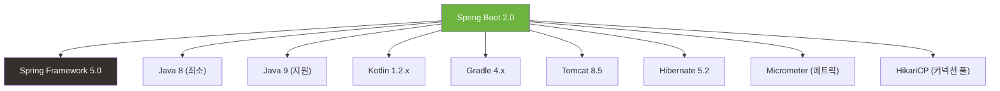

# Spring Boot 2.0 릴리즈 노트

> 출시일: 2018-03 | Java 최소 버전: 8 | [공식 릴리즈 노트](https://github.com/spring-projects/spring-boot/wiki/Spring-Boot-2.0-Release-Notes)

## 개요

Spring Boot 2.0은 **Spring Framework 5.0** 기반의 메이저 업그레이드로, **리액티브 프로그래밍(Spring WebFlux)**, **Micrometer 메트릭**, **Actuator 전면 재설계** 등 대규모 변화를 포함합니다. Java 9 지원, Kotlin 지원, HikariCP 기본 채택 등 현대적인 개발 환경으로의 전환이 이루어진 중요한 버전입니다.

---

## 플랫폼 요구사항

| 항목 | 버전 |
|------|------|
| Java | 8 이상 (Java 9 지원) |
| Spring Framework | [5.0](../../spring-framework/5.x/5.0.md) |
| Gradle | 4.x 이상 |
| Maven | 3.2 이상 |
| Tomcat | 8.5 |
| Hibernate | 5.2 |
| Thymeleaf | 3 |

---

## 주요 변경사항

### 1. Spring WebFlux 자동 구성 (리액티브 웹)

Spring WebFlux는 **논블로킹(Non-blocking) 방식**의 웹 프레임워크입니다. 적은 스레드로 많은 요청을 처리할 수 있어 높은 동시성이 필요한 서비스에 적합합니다.

```java
// 어노테이션 기반 리액티브 컨트롤러
@RestController
public class UserController {

    // Mono: 0 또는 1개의 결과를 비동기로 반환
    @GetMapping("/users/{id}")
    public Mono<User> getUser(@PathVariable Long id) {
        return userRepository.findById(id);
    }

    // Flux: 0~N개의 결과를 비동기 스트림으로 반환
    @GetMapping("/users")
    public Flux<User> getAllUsers() {
        return userRepository.findAll();
    }
}
```

내장 서버로 **Netty 4.1**을 사용할 수 있으며, 리액티브 데이터 접근(MongoDB, Redis, Cassandra, Couchbase)도 지원합니다.

### 2. Actuator 전면 재설계

Actuator(애플리케이션 모니터링/관리 도구)가 완전히 새로워졌습니다.

- 모든 HTTP 엔드포인트가 `/actuator` 경로 아래로 이동
- 기본 노출 엔드포인트가 축소됨 (보안 강화)
- Spring MVC, WebFlux, Jersey, JMX 모두 지원하는 기술 독립적 모델

```yaml
# application.yml - 노출할 엔드포인트 설정
management:
  endpoints:
    web:
      exposure:
        include: health, info, metrics  # 원하는 엔드포인트만 노출
```

```java
// 커스텀 엔드포인트 작성 예시
@Endpoint(id = "custom")          // 기술에 독립적인 엔드포인트 정의
public class CustomEndpoint {

    @ReadOperation                 // GET 요청에 매핑
    public Map<String, String> info() {
        return Map.of("status", "running");
    }
}
```

### 3. Micrometer 메트릭 (차세대 메트릭 시스템)

Micrometer는 애플리케이션의 성능 지표를 수집하는 라이브러리입니다. Prometheus, Datadog, Graphite 등 다양한 모니터링 시스템과 연동됩니다.

```java
// Micrometer를 이용한 커스텀 메트릭 등록
@Component
public class OrderService {

    private final Counter orderCounter;

    public OrderService(MeterRegistry registry) {
        // 주문 수를 세는 카운터 등록
        this.orderCounter = registry.counter("orders.created");
    }

    public void createOrder(Order order) {
        // 비즈니스 로직 ...
        orderCounter.increment();  // 주문 생성 시 카운터 증가
    }
}
```

### 4. HikariCP 기본 커넥션 풀

데이터베이스 커넥션 풀(DB 연결을 재사용하는 기술)이 Tomcat Pool에서 **HikariCP**로 변경되었습니다. HikariCP는 더 빠르고 가볍습니다.

### 5. Security 자동 구성 변경

Spring Security 5.0을 통합하며, WebFlux 환경에서도 보안 자동 구성이 동작합니다.

### 6. `@ConditionalOnBean` 동작 변경

조건부 빈 등록 시 기존 OR 로직에서 **AND 로직**으로 변경되었습니다. 여러 조건을 지정하면 모든 조건이 만족해야 빈이 등록됩니다.

---

## 새로운 기능

### Configuration Properties 바인딩 개선

설정 바인딩 메커니즘이 완전히 재설계되었습니다. `Duration` 타입을 직접 사용할 수 있습니다.

```yaml
# ISO-8601 형식 또는 간단한 표기법 사용 가능
server:
  session:
    timeout: 30m        # 30분
  connection-timeout: PT15S  # ISO-8601: 15초
```

### Kotlin 지원

Kotlin 1.2.x를 공식 지원하며, `runApplication` 함수로 Spring Boot 앱을 관용적인 Kotlin 코드로 실행할 수 있습니다.

```kotlin
// Kotlin으로 Spring Boot 앱 실행
fun main(args: Array<String>) {
    runApplication<MyApplication>(*args)
}
```

### Quartz 스케줄러 자동 구성

정해진 시간에 작업을 실행하는 Quartz 스케줄러의 자동 구성이 추가되었습니다. 메모리 및 JDBC 기반 JobStore를 지원합니다.

### HTTP/2 지원

Tomcat, Undertow, Jetty에서 HTTP/2 프로토콜을 사용할 수 있습니다.

### JSON 지원 강화

`spring-boot-starter-json` 스타터가 추가되어 Jackson + Java 8 모듈을 한 번에 가져올 수 있습니다. GSON, JSON-B도 지원합니다.

### 테스트 개선

- `@WebFluxTest`: WebFlux 슬라이스 테스트용 어노테이션
- `ApplicationContextRunner`: 자동 구성 테스트를 간편하게 작성하는 유틸리티

---

## 개선사항

- 내장 컨테이너가 시작 시 **컨텍스트 경로**를 함께 로깅
- Gradle 플러그인 전면 재작성 (Gradle 4.x 필수)
- 데이터베이스 초기화가 내장 DB에서만 기본 실행 (운영 환경 안전성 향상)
- Hibernate 커스텀 네이밍 전략을 일반 빈으로 정의 가능
- `loggers` 엔드포인트에서 로거 레벨 리셋 기능 추가
- Spring Session 사용자를 위한 `sessions` 엔드포인트 추가
- 애니메이션 GIF 배너 지원

---

## Deprecated 및 제거 항목

- Spring Boot 자체 메트릭 API 제거 (Micrometer로 대체)
- Actuator의 기존 엔드포인트 경로 변경 (`/info` -> `/actuator/info`)
- 일부 속성명 변경 (예: `server.context-path` -> `server.servlet.context-path`)

---

## 호환성



---

## 참고 자료

- [Spring Boot 2.0 공식 릴리즈 노트](https://github.com/spring-projects/spring-boot/wiki/Spring-Boot-2.0-Release-Notes)
- [Spring Boot 2.0 마이그레이션 가이드](https://github.com/spring-projects/spring-boot/wiki/Spring-Boot-2.0-Migration-Guide)
- [Spring Framework 5.0 릴리즈 노트](../../spring-framework/5.x/5.0.md)
- [Micrometer 공식 문서](https://micrometer.io/docs)
