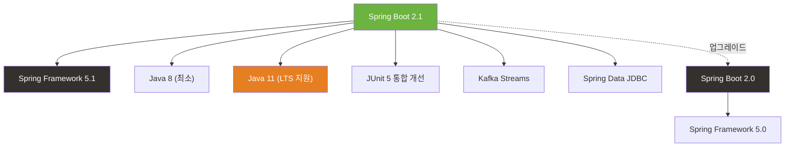

# Spring Boot 2.1 릴리즈 노트

> 출시일: 2018-10 | Java 최소 버전: 8 | [공식 릴리즈 노트](https://github.com/spring-projects/spring-boot/wiki/Spring-Boot-2.1-Release-Notes)

## 개요

Spring Boot 2.1은 **Spring Framework 5.1** 기반으로, **Java 11 공식 지원**, **빈 오버라이딩 기본 비활성화**, **성능 개선** 등 안정성과 개발 편의성에 집중한 릴리즈입니다. JUnit 5 통합 개선, `DataSize` 타입 지원, 로깅 그룹 등 실용적인 기능이 다수 추가되었습니다.

---

## 플랫폼 요구사항

| 항목 | 버전 |
|------|------|
| Java | 8 이상 (Java 11 공식 지원) |
| Spring Framework | [5.1](../../spring-framework/5.x/5.1.md) |
| Gradle | 4.4 이상 |
| Maven | 3.2 이상 |

---

## 주요 변경사항

### 1. 빈 오버라이딩 기본 비활성화

빈 오버라이딩(같은 이름의 빈을 다시 정의하여 덮어쓰는 것)이 기본적으로 **비활성화**되었습니다. 의도치 않게 빈이 덮어써지는 실수를 방지합니다.

```yaml
# 빈 오버라이딩이 필요한 경우 명시적으로 활성화
spring:
  main:
    allow-bean-definition-overriding: true
```

기존에 빈 오버라이딩에 의존하던 코드가 있다면 시작 시 `BeanDefinitionOverrideException` 에러가 발생합니다. 가능하면 빈 이름을 변경하거나 `@Primary`를 사용하는 것이 권장됩니다.

### 2. Servlet Path 속성 변경

`server.servlet.path` 속성이 `spring.mvc.servlet.path`로 이동했습니다.

```yaml
# 변경 전 (2.0)
server:
  servlet:
    path: /api

# 변경 후 (2.1)
spring:
  mvc:
    servlet:
      path: /api
```

### 3. 보안 테스트 구성 변경

`@WebMvcTest`와 `@WebFluxTest` 사용 시 사용자 정의 보안 설정(`@Configuration` + `WebSecurityConfigurerAdapter`)이 **자동으로 포함**됩니다. 이전에는 별도로 `@Import`해야 했습니다.

### 4. 서드파티 라이브러리 제거

- **Narayana JTA** 지원 제거 -> `me.snowdrop:narayana-spring-boot-starter` 사용
- **ActiveMQ 풀링** 제거 -> JMS 2.0 호환 `pooled-jms` 사용
- **Jersey 1** 지원 종료
- **json-simple** 의존성 관리 중단

---

## 새로운 기능

### 1. Java 11 공식 지원

Java 11(LTS 버전)이 공식 지원됩니다. Java 8도 계속 사용할 수 있습니다.

### 2. DataSize 타입 지원

`DataSize`는 데이터 크기를 표현하는 타입입니다. 설정 파일에서 직관적으로 크기를 지정할 수 있습니다.

```yaml
# application.yml - DataSize 사용 예시
spring:
  servlet:
    multipart:
      max-file-size: 10MB      # 10메가바이트
      max-request-size: 50MB   # 50메가바이트
```

```java
// Java 코드에서 DataSize 사용
@ConfigurationProperties("my.app")
public class MyProperties {

    // DataSize 타입으로 크기를 바인딩
    private DataSize bufferSize = DataSize.ofMegabytes(2);

    // getter, setter 생략
}
```

### 3. 프로필 표현식 (Profile Expressions)

프로필 조건을 **논리 연산자**로 조합할 수 있습니다.

```java
// production 이면서 (us-east 또는 eu-central)인 경우에만 활성화
@Profile("production & (us-east | eu-central)")
@Configuration
public class RegionalConfig {
    // 지역별 설정
}
```

### 4. 로깅 그룹

여러 로거를 하나의 그룹으로 묶어 한 번에 레벨을 변경할 수 있습니다.

```yaml
# 관련 로거들을 그룹으로 묶기
logging:
  group:
    web: org.springframework.core.codec, org.springframework.http, org.springframework.web
    sql: org.hibernate.SQL, org.springframework.jdbc.core
  level:
    web: debug    # web 그룹 전체를 DEBUG로 설정
    sql: debug    # sql 그룹 전체를 DEBUG로 설정
```

### 5. Task Execution/Scheduling 자동 구성

비동기 작업 실행(`@Async`)과 스케줄링(`@Scheduled`)을 위한 스레드 풀이 자동 구성됩니다.

```yaml
# 비동기 작업 스레드 풀 설정
spring:
  task:
    execution:
      pool:
        core-size: 8            # 기본 스레드 수
        max-size: 16            # 최대 스레드 수
        queue-capacity: 100     # 대기열 크기
    scheduling:
      pool:
        size: 2                 # 스케줄링 스레드 수
```

### 6. Kafka Streams 자동 구성

`kafka-streams` 의존성이 있으면 자동으로 Kafka Streams가 구성됩니다.

### 7. Spring Data JDBC 지원

SQL을 자동 생성해주는 Spring Data JDBC 리포지토리를 사용할 수 있습니다. JPA보다 가볍고 단순한 데이터 접근이 필요할 때 유용합니다.

---

## 개선사항

### JUnit 5 통합 개선

모든 `@...Test` 어노테이션에 `@ExtendWith(SpringExtension.class)`가 메타 어노테이션으로 포함됩니다. 별도의 선언이 필요 없습니다.

```java
// 2.0: @ExtendWith를 직접 추가해야 했음
@ExtendWith(SpringExtension.class)
@SpringBootTest
class MyServiceTest { ... }

// 2.1: @ExtendWith 불필요 - 이미 포함되어 있음
@SpringBootTest
class MyServiceTest { ... }
```

### Actuator 개선

- `/actuator/caches` 엔드포인트 추가 (캐시 매니저 조회)
- `/actuator/integrationgraph` 엔드포인트 추가 (Spring Integration 시각화)
- `/actuator/health/db` 등 **개별 헬스 인디케이터** 조회 가능
- 리액티브 Cassandra 헬스 인디케이터 추가

### Micrometer 메트릭 확대

- **공통 태그** 선언적 설정 가능
- Hibernate, WebClient, Kafka, Log4j2 메트릭 추가
- AppOptics, Humio, KariosDB 레지스트리 자동 구성 추가

### 성능 개선

Spring Framework 5.1의 최적화를 통해 **애플리케이션 시작 시간**이 개선되었습니다.

---

## Deprecated 및 제거 항목

| 항목 | 변경 내용 |
|------|-----------|
| `int` 기반 타임아웃 메서드 | `Duration` 타입 대체 메서드 사용 권장 |
| `int` 기반 크기 메서드 | `DataSize` 타입 대체 메서드 사용 권장 |
| `RestTemplateBuilder.basicAuthorization()` | `basicAuthentication()`으로 변경 |
| Hibernate EhCache 지원 | Deprecated |

---

## 호환성



---

## 참고 자료

- [Spring Boot 2.1 공식 릴리즈 노트](https://github.com/spring-projects/spring-boot/wiki/Spring-Boot-2.1-Release-Notes)
- [Spring Boot 2.0 릴리즈 노트](./2.0.md)
- [Spring Framework 5.1 릴리즈 노트](../../spring-framework/5.x/5.1.md)
