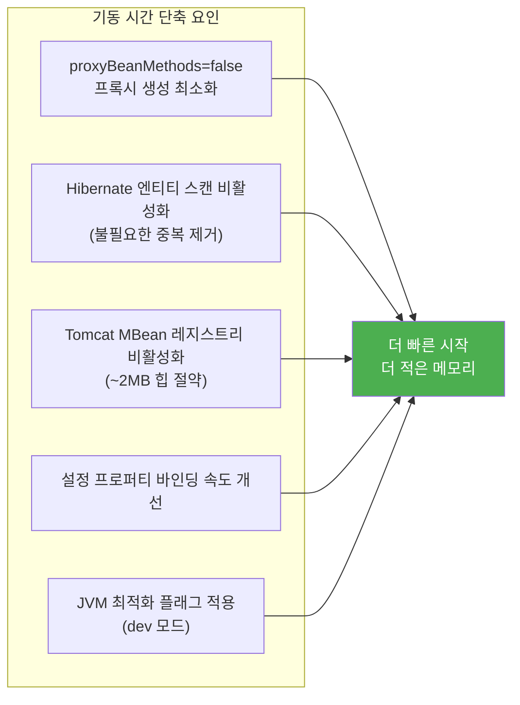
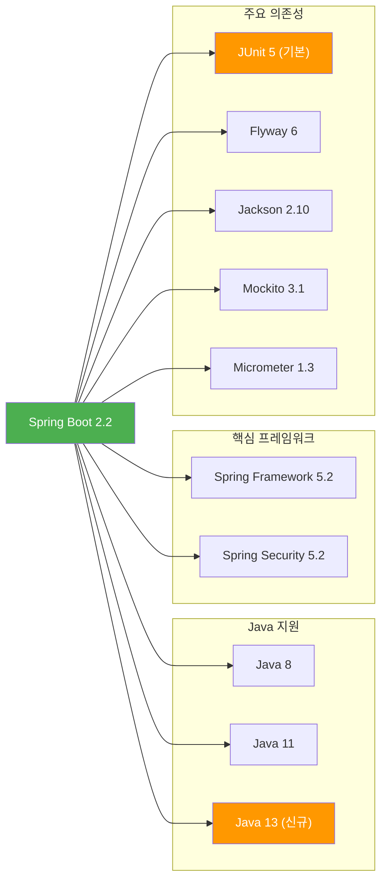

# Spring Boot 2.2 릴리즈 노트

> 출시일: 2019-10 | Java 최소 버전: 8 | [공식 릴리즈 노트](https://github.com/spring-projects/spring-boot/wiki/Spring-Boot-2.2-Release-Notes)

## 개요

Spring Boot 2.2는 **Spring Framework 5.2**를 기반으로 하며, **성능 최적화**에 큰 초점을 맞춘 버전입니다.
기동 시간 단축과 메모리 사용량 감소가 이루어졌고, **지연 초기화(Lazy Initialization)**, **JUnit 5 기본 전환**,
**불변(Immutable) `@ConfigurationProperties` 바인딩** 등 개발 생산성을 높이는 기능이 추가되었습니다.

---

## 플랫폼 요구사항

| 항목 | 요구 버전 |
|------|----------|
| **Java** | 8, 11, 13 |
| **Spring Framework** | 5.2 |
| **Gradle** | 4.10+ |
| **Maven** | 3.2+ |
| **Tomcat** | 9.0 |
| **Jetty** | 9.4 |
| **Undertow** | 2.0 |

---

## 주요 변경사항

### 1. JMX 기본 비활성화

JMX(Java Management Extensions, Java 애플리케이션을 원격으로 모니터링/관리하는 기술)가 더 이상 기본으로 활성화되지 않습니다. 필요한 경우 명시적으로 설정해야 합니다.

```properties
# application.properties
# JMX를 사용하려면 명시적으로 활성화
spring.jmx.enabled=true
```

### 2. JUnit 5 기본 테스트 프레임워크

`spring-boot-starter-test`에 **JUnit 5**가 기본으로 포함됩니다. 기존 JUnit 4 테스트도 `vintage-engine`이 함께 포함되어 호환됩니다.

```java
// JUnit 5 스타일 테스트 (기본)
import org.junit.jupiter.api.Test;
import org.springframework.boot.test.context.SpringBootTest;

@SpringBootTest
class MyApplicationTests {

    @Test
    void contextLoads() {
        // 애플리케이션 컨텍스트가 정상적으로 로드되는지 확인
    }
}
```

### 3. Jakarta EE 의존성 이름 변경

일부 라이브러리의 Maven 좌표(artifact ID)가 `javax` 에서 `jakarta`로 변경되었습니다.

| 변경 전 | 변경 후 |
|---------|---------|
| `com.sun.mail:javax.mail` | `com.sun.mail:jakarta.mail` |
| `org.glassfish:javax.el` | `org.glassfish:jakarta.el` |

### 4. 로깅 프로퍼티 변경

```properties
# 변경 전 (deprecated)
logging.file=myapp.log
logging.path=/var/log

# 변경 후
logging.file.name=myapp.log
logging.file.path=/var/log
```

### 5. Maven 플러그인 포크(Fork) 방식 변경

Maven 플러그인으로 애플리케이션을 실행할 때 기본적으로 **별도 프로세스(forked)**로 실행됩니다. 따라서 `-D` 플래그로 시스템 프로퍼티를 전달하려면 추가 설정이 필요합니다.

---

## 새로운 기능

### 1. 지연 초기화 (Lazy Initialization)

모든 빈(Bean)의 초기화를 애플리케이션 시작 시가 아닌 **실제 사용 시점으로 미루는** 기능입니다. 기동 시간이 크게 단축됩니다.

```properties
# 전역 지연 초기화 활성화
spring.main.lazy-initialization=true
```

```java
// 특정 빈은 지연 초기화에서 제외하고 싶을 때
@Component
@Lazy(false)  // 이 빈은 즉시 초기화됨
public class EagerBean {
    // 시작과 동시에 반드시 초기화되어야 하는 빈
}
```

> **주의:** 지연 초기화를 사용하면 설정 오류가 시작 시점이 아닌 런타임에 발견될 수 있습니다.
> 프로덕션보다는 **개발 환경**에서 활용하는 것을 권장합니다.

### 2. 불변 @ConfigurationProperties 바인딩

`@ConstructorBinding`을 사용하여 설정 값을 **불변 객체(Immutable Object)**로 바인딩할 수 있습니다.

```java
// 생성자를 통한 불변 설정 바인딩
@ConfigurationProperties("app.mail")
@ConstructorBinding  // 생성자 기반 바인딩 활성화
public class MailProperties {
    private final String host;       // final 필드 사용 가능
    private final int port;
    private final String username;

    public MailProperties(String host, int port, String username) {
        this.host = host;
        this.port = port;
        this.username = username;
    }

    // Getter만 제공 (Setter 없음 = 불변)
    public String getHost() { return host; }
    public int getPort() { return port; }
    public String getUsername() { return username; }
}
```

`@ConfigurationPropertiesScan`을 사용하면 `@EnableConfigurationProperties` 없이도 자동으로 설정 클래스를 스캔합니다.

### 3. RSocket 지원

RSocket(리액티브 스트리밍 프로토콜)을 위한 자동 설정과 스타터가 추가되었습니다.

```xml
<!-- RSocket 스타터 추가 -->
<dependency>
    <groupId>org.springframework.boot</groupId>
    <artifactId>spring-boot-starter-rsocket</artifactId>
</dependency>
```

CBOR(바이너리 데이터 포맷)과 JSON을 이용한 페이로드 인코딩/디코딩이 자동 설정됩니다.

### 4. Health Indicator 그룹

헬스 인디케이터(상태 체크 기능)를 그룹으로 묶어 관리할 수 있습니다. 쿠버네티스의 Liveness/Readiness 프로브 구성에 유용합니다.

```properties
# 헬스 인디케이터 그룹 설정
management.endpoint.health.group.liveness.include=livenessState
management.endpoint.health.group.readiness.include=readinessState,db
```

> 헬스 엔드포인트 JSON 응답에서 `details` 키가 `components`로 변경되었습니다.

### 5. SAML 2.0 자동 설정

`spring-security-saml2-service-provider` 의존성이 있으면 **SAML 2.0 기반 인증**이 자동 설정됩니다.

---

## 개선사항

### 성능 최적화

이 버전의 핵심 테마는 **성능 개선**입니다.



### 기타 개선

- **Kubernetes 감지**: `@ConditionalOnCloudPlatform`에서 쿠버네티스 환경을 감지 가능
- **H2 콘솔 URL 로깅**: 시작 시 H2 데이터베이스 콘솔의 JDBC 연결 URL이 로그에 출력
- **ASCII 배너**: ANSI 256 색상 코드 지원
- **Thread Dump 엔드포인트**: 일반 텍스트 형식 지원
- **`@SpringBootTest`**: 애플리케이션 인수(arguments) 전달 지원

---

## Deprecated 및 제거 항목

### 제거됨

- Spring Boot 2.1에서 Deprecated되었던 모든 클래스와 메서드가 **제거**되었습니다.
- 2.1에서 2.2로 업그레이드 전에 반드시 Deprecated 경고를 먼저 해결하세요.

### Deprecated

| 항목 | 대체 방법 |
|------|----------|
| `server.connection-timeout` | 서버별 전용 프로퍼티 사용 |
| `server.use-forward-headers` | `server.forward-headers-strategy` 사용 |
| FreeMarker 확장자 `.ftl` | `.ftlh` 사용 (HTML 자동 이스케이핑) |

### 기본값 변경 (주의 필요)

| 항목 | 변경 내용 |
|------|----------|
| HTTP Trace Actuator | 명시적 빈 등록 필요 |
| Auditing Actuator | 명시적 빈 등록 필요 |
| `HttpHiddenMethodFilter` | 기본 비활성화 (`_method` 파라미터 처리) |
| DevTools 설정 | 통합 테스트에서 DevTools 설정 미적용 |

---

## 호환성



### 주요 의존성 버전

| 프로젝트 | 버전 |
|----------|------|
| Spring Framework | 5.2 |
| Spring Security | 5.2 |
| Spring Data | Moore |
| Spring Batch | 4.2 |
| Spring AMQP | 2.2 |
| Spring Session | Corn |
| Reactor | Dysprosium |
| Micrometer | 1.3 |
| Jackson | 2.10 |
| Flyway | 6.0 |
| Kafka Client | 2.3 |
| Elasticsearch | 6.7 |
| Mockito | 3.1 |

---

## 참고 자료

- [Spring Boot 2.2 공식 릴리즈 노트](https://github.com/spring-projects/spring-boot/wiki/Spring-Boot-2.2-Release-Notes)
- [Spring Framework 5.2](../../spring-framework/5.x/5.2.md)
- [Spring Boot 2.1 릴리즈 노트](2.1.md) (이전 버전)
- [Spring Boot 2.3 릴리즈 노트](2.3.md) (다음 버전)
