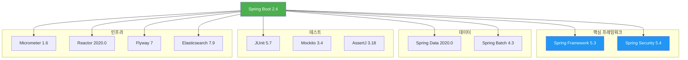
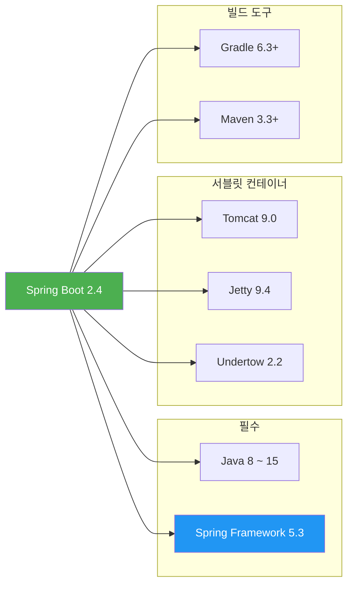

# Spring Boot 2.4 릴리즈 노트

> 출시일: 2020-11 | Java 최소 버전: 8 | [공식 릴리즈 노트](https://github.com/spring-projects/spring-boot/wiki/Spring-Boot-2.4-Release-Notes)

## 개요

Spring Boot 2.4는 **Spring Framework 5.3**을 기반으로, 설정 파일 처리 방식을 대폭 개편하고 Docker 이미지 빌드 지원을 강화한 버전입니다.
`spring.config.import`를 통한 외부 설정 파일 가져오기, Kubernetes 설정 트리 지원, 그리고 레이어드 JAR(Layered JAR) 기본 활성화 등
클라우드 네이티브 환경을 위한 핵심 기능이 추가되었습니다.

> **버전 체계 변경:** 이 버전부터 `2.3.5.RELEASE` 형식 대신 `2.4.0` 형식으로 변경되었습니다.
> 빌드 파일의 버전 표기를 업데이트하세요.

---

## 플랫폼 요구사항

| 항목 | 요구 버전 |
|------|----------|
| **Java** | 8 이상 (Java 15까지 지원) |
| **Spring Framework** | 5.3 |
| **Gradle** | 6.3+ |
| **Maven** | 3.3+ |
| **Tomcat** | 9.0 |
| **Jetty** | 9.4 |
| **Undertow** | 2.2 |

---

## 주요 변경사항

### 1. 설정 파일 처리 방식 변경

Spring Boot 2.4에서 가장 큰 변경사항입니다. `application.properties`와 `application.yml` 파일의 처리 방식이 전면 개편되었습니다.

**핵심 변경 내용:**
- 외부 설정 파일을 `spring.config.import`로 가져올 수 있음
- Kubernetes 스타일의 설정 트리(Config Tree, 개별 파일에 키/값 쌍 저장) 지원
- 확장자 없는 설정 파일도 힌트를 통해 가져오기 가능

```yaml
# application.yml - 외부 설정 가져오기 예제
spring:
  config:
    import:
      - optional:file:/etc/myapp/config.yml     # 외부 파일 (없어도 에러 없음)
      - optional:configtree:/run/secrets/        # Kubernetes 설정 트리
      - /etc/myconfig[.yaml]                     # 확장자 힌트 지정
```

> **호환 모드:** 기존 방식이 필요하면 `spring.config.use-legacy-processing=true`를 설정하세요.

**주의사항:**
- `spring.config.location`과 `spring.config.import`로 지정한 파일이 없으면 **에러가 발생**합니다.
- 선택적 로딩이 필요하면 `optional:` 접두사를 사용하세요.

### 2. JUnit 5 Vintage 엔진 제거

`spring-boot-starter-test`에서 JUnit 4 호환용 Vintage 엔진이 제거되었습니다.

```xml
<!-- JUnit 4를 계속 사용해야 한다면 직접 의존성 추가 필요 -->
<dependency>
    <groupId>org.junit.vintage</groupId>
    <artifactId>junit-vintage-engine</artifactId>
    <scope>test</scope>
    <exclusions>
        <exclusion>
            <groupId>org.hamcrest</groupId>
            <artifactId>hamcrest-core</artifactId>
        </exclusion>
    </exclusions>
</dependency>
```

### 3. 내장 데이터베이스 감지 변경

**인메모리(In-Memory)** 데이터베이스만 내장 DB로 인식합니다. H2, HSQL, Derby 등이 파일 모드나 서버 모드로 동작할 경우 더 이상 자동으로 `sa` 사용자명이 설정되지 않습니다.

```properties
# 파일 기반 H2를 사용하는 경우 직접 설정 필요
spring.datasource.username=sa
spring.datasource.initialization-mode=always
```

### 4. DefaultServlet 등록 중단

서블릿 컨테이너의 `DefaultServlet`이 더 이상 자동 등록되지 않습니다.

```properties
# 이전 동작이 필요한 경우
server.servlet.register-default-servlet=true
```

### 5. 기타 주요 변경

- **Logback 프로퍼티 이름 변경:** `logging.file.*` -> `logging.logback.rollingpolicy.*`로 변경 (Logback 전용 명시)
- **HTTP Trace 쿠키 제외:** 보안을 위해 `Cookie`/`Set-Cookie` 헤더가 기본 제외
- **Neo4j 전면 개편:** Neo4j OGM 제거, 설정 네임스페이스 `spring.neo4j.*`로 변경
- **Hazelcast 4 업그레이드:** 하위 호환은 3.2.x까지 지원
- **Undertow 경로 보존:** 포워딩 요청 시 서블릿 스펙 준수로 변경

---

## 새로운 기능

### 레이어드 JAR 기본 활성화

레이어드 JAR(Layered JAR)과 레이어 도구(layertools)가 **기본으로 활성화**되어 Docker 이미지 빌드 효율이 향상됩니다. 프로젝트 모듈 의존성은 별도 "application" 레이어에 배치됩니다.

### Docker 이미지 빌드 개선

- Maven `spring-boot:build-image` / Gradle `bootBuildImage` 태스크로 Docker 레지스트리에 직접 퍼블리시 가능
- 프라이빗 레지스트리 인증 (사용자명/비밀번호, 토큰 기반) 지원
- Paketo Buildpack 업그레이드 및 Docker Hub 기본 레지스트리 설정

### Startup Endpoint (시작 추적 엔드포인트)

애플리케이션 시작 과정을 추적하는 새로운 Actuator 엔드포인트가 추가되었습니다. 느리게 초기화되는 빈(Bean)을 식별하는 데 유용합니다.

### Redis 캐시 메트릭

```properties
# Redis 캐시 통계를 Micrometer를 통해 노출
spring.cache.redis.enable-statistics=true
```

캐시 적중(hit), 누락(miss), 삽입(put), 삭제(delete), 대기 시간 등의 메트릭을 확인할 수 있습니다.

### 웹 설정 프로퍼티 통합

Spring MVC와 WebFlux 모두에서 사용 가능한 통합 프로퍼티가 추가되었습니다.

| 새 프로퍼티 | 설명 |
|------------|------|
| `spring.web.locale` | 로케일 설정 |
| `spring.web.locale-resolver` | 로케일 리졸버 |
| `spring.web.resources.*` | 정적 리소스 설정 |
| `management.server.base-path` | 관리 서버 기본 경로 |

### Constructor Binding에 @Name 어노테이션

생성자 바인딩에서 Java 예약어와 충돌하는 프로퍼티 이름을 `@Name`으로 지정할 수 있습니다.

```java
// Java의 예약어 'import'를 프로퍼티 이름으로 사용하는 예제
@ConstructorBinding
public class MyProperties {
    private final String importPath;

    public MyProperties(@Name("import") String importPath) {
        this.importPath = importPath;
    }
}
```

### 기타 새 기능

- Java 15 지원, R2DBC용 `R2dbcEntityTemplate` 제공
- `@DataCassandraTest` 슬라이스 테스트 및 `CassandraDriverHealthIndicator` 추가
- Flyway 7 업그레이드, Prometheus 엔드포인트 필터링
- JVM 버전 시작 로그, Jedis 선택 (`spring.redis.client-type`), 로그 인코딩 설정

---

## 주요 의존성 업그레이드



<details>
<summary>전체 의존성 목록 펼치기</summary>

| 프로젝트 | 버전 |
|----------|------|
| Spring Framework | 5.3 |
| Spring Security | 5.4 |
| Spring Data | 2020.0 |
| Spring Batch | 4.3 |
| Spring AMQP | 2.3 |
| Spring Integration | 5.4 |
| Spring HATEOAS | 1.2 |
| Spring Kafka | 2.6 |
| Spring Retry | 1.3 |
| Spring Session | 2020.0 |
| Micrometer | 1.6 |
| Reactor | 2020.0 |
| JUnit | 5.7 |
| Mockito | 3.4 |
| AssertJ | 3.18 |
| Flyway | 7 |
| Elasticsearch | 7.9 |
| Lettuce | 6.0 |
| Hazelcast | 4 |
| Undertow | 2.2 |

</details>

---

## Deprecated 및 제거 항목

### Deprecated

| 항목 | 대체 방법 |
|------|----------|
| `ConfigFileApplicationListener` | `ConfigDataEnvironmentPostProcessor` 사용 |
| `contextClass` 메서드 (SpringApplication) | `contextFactory` 메서드 사용 |
| Spring MVC 전용 리소스 프로퍼티 | `spring.web.resources.*` 사용 |
| Cassandra Spring Data 기반 헬스 인디케이터 | 드라이버 기반 인디케이터 사용 |
| Logback 관련 `LoggingSystemProperties` 상수 | `LogbackLoggingSystemProperties` 사용 |

### 제거

- **Neo4j OGM 지원** 완전 제거
- **Elasticsearch 저수준 `RestClient`** 자동 설정 제거 (`RestHighLevelClient`는 유지)
- Flatten Maven Plugin 관리 제거
- `exec-maven-plugin` 버전 관리 제거

---

## 호환성



---

## 참고 자료

- [Spring Boot 2.4 공식 릴리즈 노트](https://github.com/spring-projects/spring-boot/wiki/Spring-Boot-2.4-Release-Notes)
- [Spring Boot 2.4 Configuration Changelog](https://github.com/spring-projects/spring-boot/wiki/Spring-Boot-2.4-Configuration-Changelog)
- [Spring Framework 5.3](../../spring-framework/5.x/5.3.md)
- [Spring Boot 2.5 릴리즈 노트](2.5.md)
