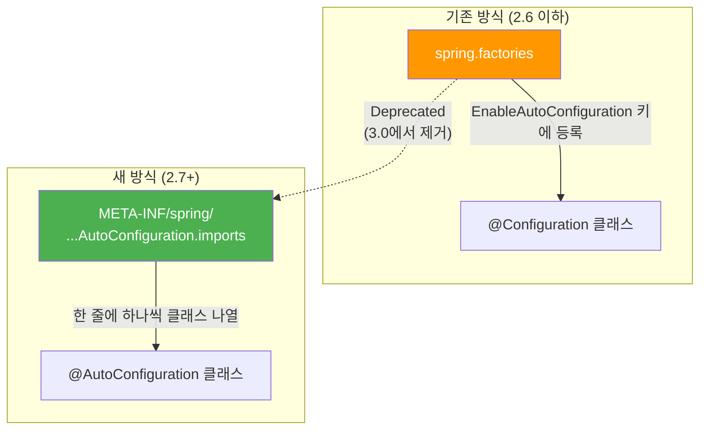
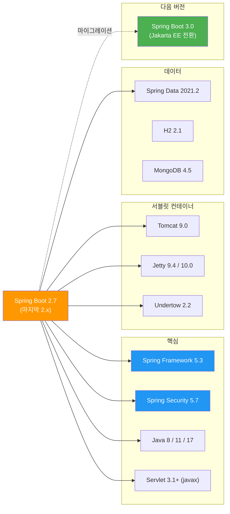

# Spring Boot 2.7 릴리즈 노트

> 출시일: 2022-05 | Java 최소 버전: 8 | [공식 릴리즈 노트](https://github.com/spring-projects/spring-boot/wiki/Spring-Boot-2.7-Release-Notes)

## 개요

Spring Boot 2.7은 **2.x 시리즈의 마지막 버전**으로, 3.0으로의 전환을 준비하는 중요한 릴리즈입니다.
**자동 설정 등록 방식(`@AutoConfiguration`)** 이 새롭게 도입되었고, **Spring for GraphQL 스타터**,
**Cache2k 지원**, **Podman 이미지 빌드** 등 실용적인 기능이 추가되었습니다.
또한 `WebSecurityConfigurerAdapter` 등 3.0에서 제거될 항목들이 대거 폐기(deprecated) 처리되었습니다.

> **중요:** 2.7은 2.x의 마지막 버전이며, OSS 지원은 2023년 11월에 종료되었습니다.
> 보안 패치를 받으려면 [3.x로 마이그레이션](../../migration-guides/spring-boot-2to3.md)해야 합니다.

---

## 플랫폼 요구사항

| 항목 | 요구 버전 |
|------|----------|
| **Java** | 8, 11 또는 17 |
| **Spring Framework** | [5.3](../../spring-framework/5.x/5.3.md) |
| **Spring Security** | 5.7 |
| **Spring Data** | 2021.2 |
| **Servlet API** | 3.1+ (`javax.servlet`) |
| **Gradle** | 6.8+, 6.9 또는 7.x |
| **Maven** | 3.5+ |
| **Kafka** | 3.1 |
| **Micrometer** | 1.9 |

---

## 주요 변경사항

### 1. 자동 설정 등록 방식 변경 (`@AutoConfiguration`)

자동 설정(Auto-Configuration)이란 클래스패스의 라이브러리를 감지해 자동으로 빈을 등록하는 Spring Boot의 핵심 기능입니다.
2.7부터 등록 방식이 크게 변경되었습니다.



**새 파일 경로:** `META-INF/spring/org.springframework.boot.autoconfigure.AutoConfiguration.imports`

```text
# META-INF/spring/org.springframework.boot.autoconfigure.AutoConfiguration.imports
# 한 줄에 하나의 자동 설정 클래스 FQCN(풀 클래스명)을 작성합니다
com.example.MyAutoConfiguration
com.example.AnotherAutoConfiguration
```

```java
// @Configuration 대신 @AutoConfiguration을 사용
// 순서를 어노테이션 속성으로 직접 지정 가능
@AutoConfiguration(
    after = DataSourceAutoConfiguration.class,
    before = JpaRepositoriesAutoConfiguration.class
)
@ConditionalOnClass(MyLibrary.class)
public class MyAutoConfiguration {
    // 자동 설정 빈 정의
}
```

> **호환성:** 기존 `spring.factories` 방식도 2.7에서는 여전히 동작하지만, 3.0에서 제거됩니다.
> 미리 새 방식으로 전환할 것을 권장합니다.

### 2. `@SpringBootTest` 프로퍼티 소스 우선순위 변경

테스트 프로퍼티 소스가 커맨드 라인 인자(args)보다 **높은 우선순위**를 갖게 되었습니다.
`properties`와 `args`에 같은 이름의 프로퍼티를 설정했다면 결과가 달라질 수 있습니다.

### 3. H2 2.x 업그레이드

H2 데이터베이스가 2.1.120으로 업그레이드되었습니다. 하위 호환성이 없는 변경사항이 포함되어 있으므로,
H2를 사용하는 테스트가 있다면 주의가 필요합니다.

### 4. SQL Server JDBC 드라이버 변경

Microsoft SQL Server JDBC 드라이버가 v10으로 업그레이드되어 **암호화가 기본 활성화**됩니다.
기존 연결이 깨질 수 있으므로 연결 문자열을 확인해야 합니다.

### 5. MySQL JDBC 드라이버 좌표 변경

```xml
<!-- 이전 -->
<dependency>
    <groupId>mysql</groupId>
    <artifactId>mysql-connector-java</artifactId>
</dependency>

<!-- 변경 후 (8.0.32+) -->
<dependency>
    <groupId>com.mysql</groupId>
    <artifactId>mysql-connector-j</artifactId>
</dependency>
```

### 6. OkHttp 4 버전 프로퍼티 변경

OkHttp 버전 오버라이드 프로퍼티가 `okhttp3.version`에서 `okhttp.version`으로 변경되었습니다.

### 7. 메트릭 태그 키 명명 규칙 변경

메트릭 태그 키가 소문자 + 점(`.`) 구분자 형식으로 통일되었습니다:

| 이전 | 변경 후 |
|------|---------|
| `main-application-class` | `main.application.class` |
| `cacheManager` | `cache.manager` |
| `clientName` | `client.name` |

---

## 새로운 기능

### Spring for GraphQL 스타터

GraphQL(API 쿼리 언어)을 위한 공식 스타터가 추가되었습니다.
기존의 `graphql-spring-boot-starter` 커뮤니티 프로젝트 대신 공식 지원을 사용할 수 있습니다:

```xml
<!-- Spring for GraphQL 의존성 추가 -->
<dependency>
    <groupId>org.springframework.boot</groupId>
    <artifactId>spring-boot-starter-graphql</artifactId>
</dependency>
```

### Cache2k 지원

Cache2k는 경량 고성능 Java 캐시 라이브러리입니다.
의존성 관리와 자동 설정이 추가되어, 클래스패스에 추가하면 바로 사용할 수 있습니다.

### Podman 컨테이너 이미지 빌드 지원

Docker 대안인 Podman(루트 권한 없이 컨테이너를 실행할 수 있는 도구)을 사용해
Spring Boot 이미지를 빌드할 수 있게 되었습니다.

### PEM 인증서로 SSL 설정

키스토어(JKS, PKCS12) 대신 **PEM 형식의 인증서 파일**을 직접 사용할 수 있습니다:

```properties
server.ssl.certificate=classpath:cert.pem
server.ssl.certificate-private-key=classpath:key.pem
```

### Jackson `@JsonMixin` 자동 감지

`@JsonMixin` 어노테이션으로 Jackson 믹스인(직렬화/역직렬화 커스터마이징)을 자동 등록할 수 있습니다:

```java
@JsonMixin(User.class)
public abstract class UserMixin {
    @JsonIgnore
    abstract String getPassword(); // password 필드를 JSON에서 제외
}
```

### 기타 새로운 기능

- **SAML2 로그아웃 자동 설정**: Spring Security의 SAML2 로그아웃이 자동으로 설정됩니다
- **Actuator OS/Java 벤더 정보**: `/actuator/info`에서 운영체제와 Java 벤더 정보 확인 가능
- **`@DataCouchbaseTest` / `@DataElasticsearchTest`**: 데이터 계층 슬라이스 테스트 어노테이션 추가
- **Redis Sentinel 사용자 인증**: 사용자 이름 기반 인증 지원
- **RabbitMQ Stream 자동 설정**: `RabbitStreamTemplate` 자동 설정 추가

---

## 개선사항

- **Hazelcast `@SpringAware` 지원**: `SpringManagedContext`를 통한 Hazelcast 빈의 Spring 의존성 주입
- **Flyway 모듈 분리**: 데이터베이스별 Flyway 지원이 별도 모듈로 분리 (MySQL, SQL Server, Firebird 등)
- **R2DBC PostgreSQL 드라이버**: 그룹 ID가 `io.r2dbc` → `org.postgresql`로 변경
- **Elasticsearch RestHighLevelClient**: 저수준 `RestClient` 사용 권장으로 전환 시작

---

## Deprecated 및 제거 항목

### Deprecated (3.0에서 제거 예정)

2.7에서 폐기된 항목은 Spring Boot 3.0 마이그레이션을 준비하기 위한 것입니다.

| 항목 | 대체 방안 |
|------|----------|
| `spring.factories`를 통한 자동 설정 등록 | `AutoConfiguration.imports` 파일 사용 |
| `WebSecurityConfigurerAdapter` | `SecurityFilterChain` 빈 등록 방식 사용 |
| Hazelcast 3.x 지원 | Hazelcast 4.x+ 사용 |
| `DatabaseDriver.GAE` | - |
| Maven 플러그인 `spring-boot:run`의 `fork` 속성 | - |
| Mustache 서블릿 전용 프로퍼티 | `spring.mustache.servlet.*` 네임스페이스로 이동 |

`WebSecurityConfigurerAdapter` 변경은 특히 영향 범위가 넓습니다:

```java
// 이전 방식 (Deprecated) - WebSecurityConfigurerAdapter 상속
@Configuration
public class SecurityConfig extends WebSecurityConfigurerAdapter {
    @Override
    protected void configure(HttpSecurity http) throws Exception {
        http.authorizeRequests()
            .anyRequest().authenticated();
    }
}

// 새 방식 - SecurityFilterChain 빈 등록
@Configuration
public class SecurityConfig {
    @Bean
    public SecurityFilterChain filterChain(HttpSecurity http) throws Exception {
        http.authorizeHttpRequests(auth -> auth
            .anyRequest().authenticated()
        );
        return http.build();
    }
}
```

---

## 호환성



> **3.0으로의 전환:** Spring Boot 3.0은 `javax.*` 패키지를 `jakarta.*`로 전면 교체하는 대규모 변경을 포함합니다.
> 2.7에서 Deprecated 경고를 모두 해결한 후 3.0으로 업그레이드하는 것이 권장됩니다.
> 자세한 내용은 [2.x -> 3.x 마이그레이션 가이드](../../migration-guides/spring-boot-2to3.md)를 참고하세요.

---

## 참고 자료

- [Spring Boot 2.7 공식 릴리즈 노트](https://github.com/spring-projects/spring-boot/wiki/Spring-Boot-2.7-Release-Notes)
- [Spring Framework 5.3](../../spring-framework/5.x/5.3.md)
- [Spring Boot 2.6 릴리즈 노트](2.6.md) (이전 버전)
- [2.x -> 3.x 마이그레이션 가이드](../../migration-guides/spring-boot-2to3.md)
- [Spring Boot 3.0 공식 릴리즈 노트](https://github.com/spring-projects/spring-boot/wiki/Spring-Boot-3.0-Release-Notes)
