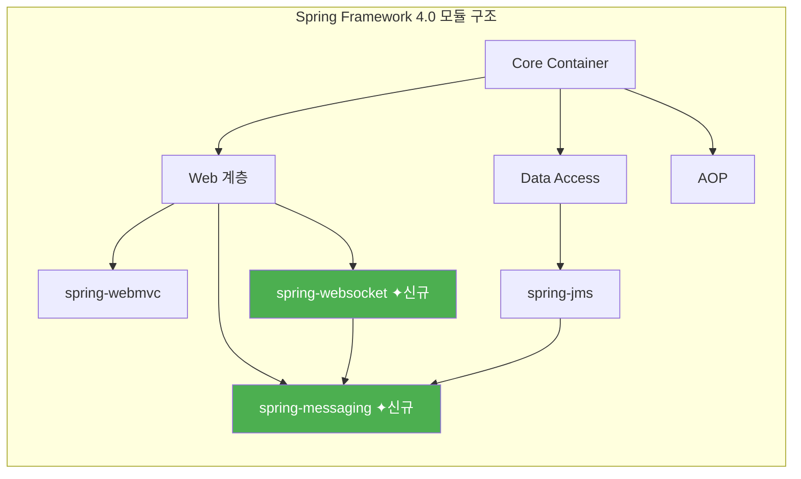
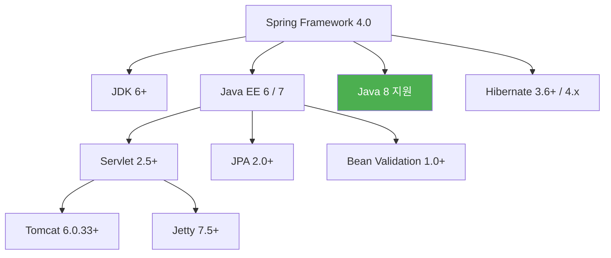

# Spring Framework 4.0 릴리즈 노트

Spring Framework 4.0은 2013년 12월에 릴리즈된 메이저 버전으로, Java 8을 최초로 공식 지원합니다. WebSocket/STOMP 기반의 실시간 통신, `@RestController`, `@Conditional` 어노테이션 등 현대적 Spring 개발의 핵심 기반을 마련한 버전입니다. 새로운 모듈로 `spring-websocket`과 `spring-messaging`이 추가되었습니다.

---

## 주요 변경사항

### 기준선(Baseline) 요구사항

| 항목 | 요구사항 |
|:---:|:---:|
| **Java** | 6+ (Java 8 지원) |
| **Servlet** | 2.5+ (3.0+에서 전체 기능 사용 가능) |
| **JPA** | 2.0+ |
| **Bean Validation** | 1.0+ |
| **Tomcat** | 6.0.33+ |
| **Jetty** | 7.5+ |

> **참고:** Java 6과 7에서도 동작하지만, Java 8의 람다 표현식 등 최신 기능을 활용하려면 Java 8 이상을 권장합니다.

### Java 8 지원

Spring Framework 4.0은 Java 8의 주요 기능을 프레임워크 전반에서 활용할 수 있도록 지원합니다.

**람다 표현식(Lambda Expression):** 콜백 인터페이스에 람다를 직접 사용하여 코드가 간결해집니다.

```java
// 기존 방식 (익명 클래스)
jdbcTemplate.query("SELECT * FROM users", new RowMapper<User>() {
    @Override
    public User mapRow(ResultSet rs, int rowNum) throws SQLException {
        return new User(rs.getString("name"), rs.getInt("age"));
    }
});

// Java 8 람다 방식 — 훨씬 간결합니다
jdbcTemplate.query("SELECT * FROM users", (rs, rowNum) ->
    new User(rs.getString("name"), rs.getInt("age"))
);
```

**JSR-310 Date-Time API:** `java.time` 패키지(`LocalDate`, `LocalDateTime` 등)를 데이터 바인딩과 포매팅에서 지원합니다.

**`@Repeatable` 어노테이션:** 같은 어노테이션을 한 요소에 여러 번 적용할 수 있습니다. 예를 들어, `@PropertySource`를 여러 번 선언할 수 있습니다.

### WebSocket / STOMP 지원

실시간 양방향 통신을 위한 WebSocket과 STOMP(Simple Text Oriented Messaging Protocol) 프로토콜을 지원합니다. 채팅, 실시간 알림 등의 기능을 구현할 때 유용합니다.

```java
@Configuration
@EnableWebSocketMessageBroker  // WebSocket 메시지 브로커 활성화
public class WebSocketConfig implements WebSocketMessageBrokerConfigurer {

    @Override
    public void configureMessageBroker(MessageBrokerRegistry config) {
        // 클라이언트가 구독할 주제(topic) 설정
        config.enableSimpleBroker("/topic");
        // 클라이언트가 메시지를 보낼 때 사용할 접두사 설정
        config.setApplicationDestinationPrefixes("/app");
    }

    @Override
    public void registerStompEndpoints(StompEndpointRegistry registry) {
        // WebSocket 연결 엔드포인트, SockJS 폴백 지원
        registry.addEndpoint("/ws").withSockJS();
    }
}
```

서버 측 메시지 처리 컨트롤러 예시:

```java
@Controller
public class ChatController {

    // 클라이언트가 "/app/chat"으로 보낸 메시지를 처리
    @MessageMapping("/chat")
    // 처리 결과를 "/topic/messages" 구독자에게 전송
    @SendTo("/topic/messages")
    public ChatMessage handleMessage(ChatMessage message) {
        return message;
    }
}
```

### @RestController

`@Controller`와 `@ResponseBody`를 결합한 새로운 어노테이션입니다. REST API를 만들 때 매 메서드마다 `@ResponseBody`를 붙이지 않아도 됩니다.

```java
// 기존 방식 — 매번 @ResponseBody를 붙여야 합니다
@Controller
public class OldApiController {
    @RequestMapping("/api/users")
    @ResponseBody
    public List<User> getUsers() {
        return userService.findAll();
    }
}

// 4.0 방식 — @RestController 하나로 충분합니다
@RestController
public class ApiController {
    @RequestMapping("/api/users")
    public List<User> getUsers() {
        return userService.findAll();
    }
}
```

> **초보자 참고:** `@RestController`는 이후 Spring Boot에서 REST API 개발의 표준이 됩니다.

### @Conditional

빈(Bean) 등록을 조건에 따라 제어하는 어노테이션입니다. 이 어노테이션은 이후 Spring Boot의 자동 구성(Auto-Configuration) 기능의 핵심 기반이 됩니다.

```java
// 조건 클래스 — 특정 환경에서만 빈을 등록합니다
public class ProductionCondition implements Condition {
    @Override
    public boolean matches(ConditionContext context, AnnotatedTypeMetadata metadata) {
        return context.getEnvironment().acceptsProfiles("production");
    }
}

@Configuration
public class AppConfig {
    @Bean
    @Conditional(ProductionCondition.class)  // 조건이 true일 때만 등록
    public DataSource productionDataSource() {
        return new ProductionDataSource();
    }
}
```

> **참고:** Spring Boot는 이를 확장하여 `@ConditionalOnClass`, `@ConditionalOnProperty` 등 다양한 조건 어노테이션을 제공합니다.

---

## 새로운 기능

### 신규 모듈

Spring Framework 4.0에서 2개의 새로운 모듈이 추가되었습니다.

| 모듈 | 설명 |
|------|------|
| `spring-websocket` | WebSocket 및 SockJS 폴백 지원 |
| `spring-messaging` | STOMP 메시징 처리 및 메시지 채널 추상화 |



### Groovy Bean Definition DSL

XML이나 Java 설정 외에 Groovy 스크립트로 빈을 정의할 수 있는 DSL(Domain-Specific Language)이 추가되었습니다.

```groovy
beans {
    dataSource(BasicDataSource) {
        driverClassName = "org.h2.Driver"
        url = "jdbc:h2:mem:testdb"
    }
    userService(UserServiceImpl) { userRepository = ref("userRepository") }
}
```

### 제네릭 기반 자동 주입(Generics as Qualifiers)

제네릭 타입 정보를 활용하여 빈을 자동으로 구분합니다. `@Qualifier` 없이도 정확한 빈이 주입됩니다.

```java
// 제네릭 타입이 다른 두 빈
@Bean
public Store<String> stringStore() {
    return new StringStore();
}

@Bean
public Store<Integer> integerStore() {
    return new IntegerStore();
}

// 주입 시 제네릭 타입으로 자동 구분 — @Qualifier가 필요 없습니다
@Autowired
private Store<String> store;  // StringStore가 주입됩니다
```

### Java EE 7 지원

| 스펙 | 버전 | 주요 개선 |
|------|------|----------|
| JMS | 2.0 | 간소화된 메시지 전송 API |
| JPA | 2.1 | Stored Procedure 호출, Criteria Update/Delete |
| Bean Validation | 1.1 | 메서드 파라미터/리턴 값 검증 |
| Concurrency Utilities | 1.0 | 관리형 스레드 풀(`ManagedExecutorService`) |

### 기타 신규 기능

- **`@Lazy` 주입 지원**: 의존성을 실제 사용 시점까지 지연 초기화
- **`@Description` 어노테이션**: 빈에 설명 메타데이터 추가
- **`@Order` 개선**: `Ordered` 인터페이스 외에 어노테이션으로도 순서 지정 가능
- **`spring-test` 강화**: `@ActiveProfiles`의 프로그래밍 방식 해석기(resolver) 지원

---

## 개선사항

### Spring MVC

| 영역 | 개선 내용 |
|------|----------|
| 비동기 요청 | `DeferredResult`, `Callable` 기반 비동기 요청 처리 강화 |
| 콘텐츠 협상 | `ContentNegotiationManager`를 통한 유연한 응답 포맷 결정 |
| URI 빌더 | `UriComponentsBuilder`의 Servlet 기반 확장 |
| `@ResponseStatus` | 예외 클래스에 직접 HTTP 상태 코드 지정 가능 |

### Spring Core

- **`@PropertySource`로 외부 설정 로드 개선**: 플레이스홀더 중첩 해석 지원
- **`Environment` 추상화 개선**: 프로파일 활성화 로직 정교화
- **`cglib` 내장**: 별도 cglib 라이브러리 의존성 불필요 (재패키징하여 포함)
- **`ASM 4.x` 내장**: 바이트코드 처리 라이브러리를 내부에 포함

---

## 폐기(Deprecated) 및 제거(Removed) 항목

### 폐기됨(Deprecated)

| 항목 | 대안 |
|------|------|
| `JpaTemplate` | 네이티브 JPA API 직접 사용 |
| `HibernateTemplate` | 네이티브 Hibernate API 직접 사용 |
| `ibatis` 지원 (iBATIS 2.x) | MyBatis 3 사용 |
| `jackson-mapper-asl` (Jackson 1.x) | Jackson 2.x (`com.fasterxml.jackson`) |
| `Burlap` 원격 호출 | 제거됨 |

### 제거됨(Removed)

- **JDK 1.5 이하 지원 코드** 제거
- **`spring-asm` 모듈** 제거 (ASM 4.x가 `spring-core`에 내장)
- **일부 레거시 예외 클래스** 정리

---

## 호환성



### Spring 포트폴리오 호환

- Spring Security 3.2
- Spring Data 1.6 (Evans)
- Spring Batch 3.0
- Spring Integration 4.0

---

## 참고 자료

- [Spring Framework 4.0 Release Notes (GitHub Wiki)](https://github.com/spring-projects/spring-framework/wiki/Spring-Framework-4.0-Release-Notes)
- [What's New in Spring Framework 4.x (GitHub Wiki)](https://github.com/spring-projects/spring-framework/wiki/What's-New-in-Spring-Framework-4.x)
- [New Features in Spring Framework 4.0 (공식 문서)](https://docs.spring.io/spring-framework/docs/4.0.x/spring-framework-reference/html/new-in-4.0.html)
- [Spring Framework 4.0 GA 릴리즈 블로그](https://spring.io/blog/2013/12/12/announcing-spring-framework-4-0-ga-release)
