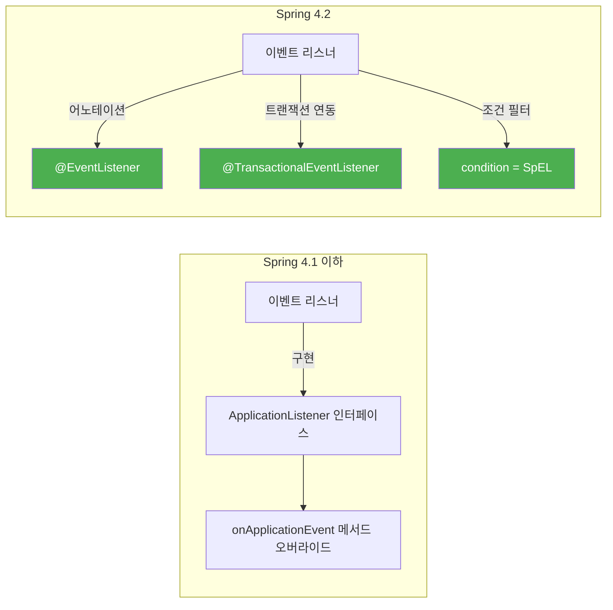
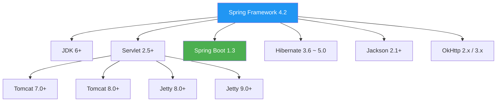

# Spring Framework 4.2 릴리즈 노트

Spring Framework 4.2는 2015년 7월에 릴리즈된 마이너 버전으로, CORS(Cross-Origin Resource Sharing) 지원, 어노테이션 기반 이벤트 리스너, 메타 어노테이션 속성 별칭(@AliasFor), HTTP 스트리밍 등 개발 편의성을 크게 높인 업데이트입니다. Hibernate 5.0 초기 지원도 포함되어 있습니다.

---

## 주요 변경사항

### 기준선(Baseline) 요구사항

Spring Framework 4.2가 요구하는 최소 환경입니다.

| 항목 | 요구사항 |
|:---:|:---:|
| **Java** | 6+ (Java 8 권장) |
| **Servlet** | 2.5+ (Servlet 3.0+ 권장) |
| **JPA** | 2.0+ |
| **Hibernate** | 3.6+ (5.0 새로 지원) |
| **Jackson** | 2.1+ (2.6+ 권장) |

> **초보자 안내:** 기준선(Baseline)이란 "최소한 이 버전 이상이어야 동작한다"는 의미입니다. Java 6에서도 동작하지만, Java 8을 사용하면 람다 등 최신 기능을 활용할 수 있습니다.

### @EventListener - 어노테이션 기반 이벤트 리스너

Spring 4.2의 가장 주목할 만한 기능입니다. 기존에는 이벤트를 처리하려면 `ApplicationListener` 인터페이스를 구현해야 했지만, 이제 `@EventListener` 어노테이션만 붙이면 됩니다.

**변경 전 (Spring 4.1 이하):**

```java
// ApplicationListener 인터페이스를 직접 구현해야 했음
@Component
public class OrderEventHandler implements ApplicationListener<OrderCreatedEvent> {

    @Override
    public void onApplicationEvent(OrderCreatedEvent event) {
        System.out.println("주문 생성됨: " + event.getOrderId());
    }
}
```

**변경 후 (Spring 4.2):**

```java
@Component
public class OrderEventHandler {

    // 메서드에 @EventListener만 붙이면 자동으로 이벤트 리스너로 등록
    @EventListener
    public void handleOrderCreated(OrderCreatedEvent event) {
        System.out.println("주문 생성됨: " + event.getOrderId());
    }

    // SpEL 조건식으로 특정 조건의 이벤트만 처리 가능
    @EventListener(condition = "#event.amount > 10000")
    public void handleHighValueOrder(OrderCreatedEvent event) {
        notifyManager(event);
    }

    // 트랜잭션 커밋 이후에 실행되는 이벤트 리스너
    @TransactionalEventListener(phase = TransactionPhase.AFTER_COMMIT)
    public void sendConfirmation(OrderCreatedEvent event) {
        emailService.sendConfirmation(event);
    }
}
```

> **초보자 안내:** `@TransactionalEventListener`는 데이터베이스 트랜잭션이 성공적으로 완료(커밋)된 후에 실행됩니다. 예를 들어, 주문이 DB에 확실히 저장된 후에 확인 이메일을 보내고 싶을 때 유용합니다. 트랜잭션이 실패(롤백)하면 이벤트 리스너는 실행되지 않습니다.



### @CrossOrigin / CORS 지원

CORS(Cross-Origin Resource Sharing)란 웹 브라우저에서 **다른 도메인의 API를 호출**할 수 있게 허용하는 보안 메커니즘입니다. 예를 들어, `https://frontend.example.com`에서 `https://api.example.com`의 데이터를 가져오려면 CORS 설정이 필요합니다.

Spring 4.2부터 `@CrossOrigin` 어노테이션과 전역 CORS 설정을 공식 지원합니다.

**컨트롤러 레벨 CORS 설정:**

```java
// 특정 도메인에서의 요청만 허용
@CrossOrigin(origins = "https://frontend.example.com")
@RestController
public class ApiController {

    @GetMapping("/data")
    public Data getData() {
        return dataService.findAll();
    }
}
```

**전역 CORS 설정:**

```java
@Configuration
public class WebConfig implements WebMvcConfigurer {

    @Override
    public void addCorsMappings(CorsRegistry registry) {
        registry.addMapping("/api/**")
            .allowedOrigins("https://frontend.example.com")
            .allowedMethods("GET", "POST", "PUT", "DELETE")
            .allowedHeaders("*")
            .maxAge(3600); // 사전 요청(Preflight) 캐시 시간(초)
    }
}
```

> **초보자 안내:** 웹 브라우저는 보안상 다른 도메인으로의 API 호출을 기본적으로 차단합니다. CORS 설정은 서버 측에서 "이 도메인의 요청은 허용한다"고 브라우저에 알려주는 역할을 합니다. `@CrossOrigin`은 컨트롤러 또는 메서드 단위, `addCorsMappings`는 애플리케이션 전체에 적용됩니다.

### @AliasFor - 메타 어노테이션 속성 별칭

`@AliasFor`는 어노테이션의 속성에 **별칭(Alias)**을 지정할 수 있는 기능입니다. 커스텀 어노테이션을 만들 때 Spring의 기존 어노테이션 속성을 재정의하거나, 같은 어노테이션 내에서 두 속성을 동일하게 취급할 수 있습니다.

```java
// 커스텀 어노테이션 정의 — @RequestMapping의 속성을 별칭으로 연결
@Target(ElementType.METHOD)
@Retention(RetentionPolicy.RUNTIME)
@RequestMapping(method = RequestMethod.GET)
public @interface GetJson {

    // @RequestMapping의 path 속성과 연결
    @AliasFor(annotation = RequestMapping.class, attribute = "path")
    String value() default "";
}

// 사용 예시 — @GetJson("/users")는 @GetMapping("/users")와 동일하게 동작
@GetJson("/users")
public List<User> getUsers() {
    return userService.findAll();
}
```

### HTTP 스트리밍 - ResponseBodyEmitter와 SseEmitter

서버에서 클라이언트로 **데이터를 지속적으로 전송**할 수 있는 HTTP 스트리밍 기능이 추가되었습니다. 실시간 알림, 진행 상태 업데이트 등에 활용할 수 있습니다.

**ResponseBodyEmitter - 일반 스트리밍:**

```java
@GetMapping("/download-progress")
public ResponseBodyEmitter progress() {
    ResponseBodyEmitter emitter = new ResponseBodyEmitter();

    // 별도 스레드에서 비동기로 데이터 전송
    executor.execute(() -> {
        try {
            for (int i = 0; i <= 100; i += 10) {
                emitter.send("진행률: " + i + "%\n");
                Thread.sleep(500);
            }
            emitter.complete(); // 전송 완료
        } catch (Exception e) {
            emitter.completeWithError(e); // 에러 발생 시
        }
    });

    return emitter;
}
```

**SseEmitter - Server-Sent Events 스트리밍:**

```java
@GetMapping("/stream")
public SseEmitter stream() {
    SseEmitter emitter = new SseEmitter();

    // 비동기로 이벤트 전송
    executor.execute(() -> {
        try {
            emitter.send(
                SseEmitter.event()
                    .name("update")         // 이벤트 이름
                    .data("새로운 데이터")    // 전송할 데이터
            );
            emitter.complete();
        } catch (Exception e) {
            emitter.completeWithError(e);
        }
    });

    return emitter;
}
```

> **초보자 안내:** `ResponseBodyEmitter`는 일반적인 스트리밍에, `SseEmitter`는 브라우저의 EventSource API와 호환되는 SSE(Server-Sent Events) 프로토콜에 사용됩니다. 채팅 알림, 주식 시세 등 서버에서 클라이언트로 실시간 데이터를 보내야 할 때 유용합니다.

---

## 새로운 기능

- **@EventListener**: 어노테이션 기반 이벤트 리스너 (위 상세 설명 참고)
- **@TransactionalEventListener**: 트랜잭션 단계에 따른 이벤트 처리
- **@CrossOrigin / CORS**: 컨트롤러 및 전역 수준의 교차 출처 요청 지원
- **@AliasFor**: 메타 어노테이션 속성 별칭 시스템
- **HTTP 스트리밍**: `ResponseBodyEmitter`, `SseEmitter`를 통한 비동기 스트리밍
- **Hibernate 5.0 지원**: Hibernate ORM 5.0 초기 버전 호환 추가
- **OkHttp 통합**: `RestTemplate`에서 OkHttp를 HTTP 클라이언트로 사용 가능
- **@Order on @Configuration**: `@Configuration` 클래스에 `@Order`를 적용하여 설정 로딩 순서 제어
- **스크립트 기반 데이터베이스 초기화**: `@Sql`과 `@SqlGroup`으로 테스트 시 SQL 스크립트 실행 개선

---

## 개선사항

| 영역 | 개선 내용 |
|------|----------|
| **HTTP 캐시 헤더** | `CacheControl` 빌더 클래스 도입으로 HTTP 캐시 헤더(Cache-Control, ETag 등) 설정이 간편해짐 |
| **정적 리소스 처리** | `ResourceResolver`와 `ResourceTransformer` 체인으로 정적 리소스 버전 관리 강화 |
| **SpEL(표현식 언어)** | 컴파일 모드 추가로 성능 향상 |
| **Jackson 직렬화** | `@JsonView` 지원으로 같은 객체를 API마다 다른 필드 구성으로 응답 가능 |
| **메시징** | `@SendTo`에서 SpEL 지원, STOMP 클라이언트 개선 |
| **테스트** | `@ContextConfiguration`에서 초기화 클래스 지원, `MockMvc` 비동기 테스트 개선 |
| **JMS** | `@JmsListener`에서 응답 메시지 지원 개선 |

### CacheControl 빌더 예시

```java
@GetMapping("/resources")
public ResponseEntity<Resource> getResource() {
    return ResponseEntity.ok()
        .cacheControl(CacheControl.maxAge(30, TimeUnit.MINUTES)
            .noTransform()
            .mustRevalidate())
        .body(resource);
}
```

---

## 폐기(Deprecated) 및 제거(Removed) 항목

### 폐기 예고 (Deprecated)

| 항목 | 대안 |
|------|------|
| `AbstractAnnotationConfigDispatcherServletInitializer`의 일부 메서드 | 새로운 콜백 메서드 사용 |
| `JdbcTemplate`의 일부 쿼리 메서드 | 개선된 오버로드 메서드 사용 |
| 일부 레거시 MVC 설정 | Java Config 기반 설정으로 전환 권장 |

### 참고: 향후 제거 예정

Spring 4.2에서 직접 제거된 항목은 적지만, 다음 메이저 버전(5.0)에서 대규모 정리가 예정되어 있었습니다.

- **Hibernate 3.x / 4.x 전용 API** — 5.0에서 제거 예정, Hibernate 5.x로 업그레이드 권장
- **Tiles 2.x** — Tiles 3.x로 업그레이드 권장
- **Velocity 지원** — Apache Velocity 프로젝트 비활성으로 인해 5.0에서 제거 예정

---

## 호환성



### Spring 포트폴리오 호환

- **Spring Boot 1.3** — Spring Framework 4.2 기반
- **Spring Security 4.0** — CORS 필터와 연동 가능
- **Spring Data Gosling / Hopper** — 호환

---

## 참고 자료

- [What's New in Spring Framework 4.x (GitHub Wiki)](https://github.com/spring-projects/spring-framework/wiki/What's-New-in-Spring-Framework-4.x)
- [Spring Blog - Spring Framework 4.2 goes GA](https://spring.io/blog/2015/07/31/spring-framework-4-2-goes-ga)
