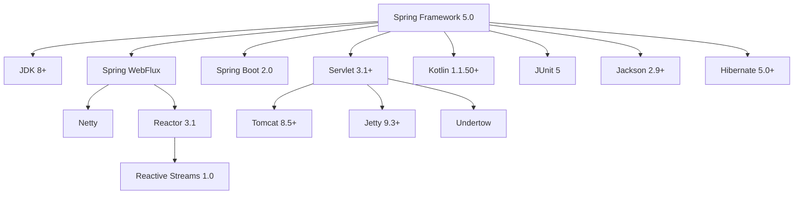

# Spring Framework 5.0 릴리즈 노트

Spring Framework 5.0은 2017년 9월에 릴리즈된 혁신적인 메이저 버전입니다. 리액티브 웹 프레임워크인 **Spring WebFlux**를 도입하고, **Kotlin 공식 지원**, **JUnit 5 통합**, **Java 8 기준선** 전환 등 현대적인 애플리케이션 개발을 위한 기반을 마련했습니다. Spring Boot 2.0이 이 버전을 기반으로 합니다.

---

## 주요 변경사항

### Java 8+ 기준선 (Baseline)

Spring Framework 5.0은 최소 Java 8을 요구하며, JDK 9와도 호환됩니다.

| 항목 | 요구사항 |
|:---:|:---:|
| **Java** | 8+ (JDK 9 호환) |
| **Servlet** | 3.1+ |
| **Tomcat** | 8.5+ |
| **Jackson** | 2.9+ |
| **Kotlin** | 1.1.50+ |
| **Reactor** | 3.1 (Reactive Streams 1.0) |

> **참고:** Java 8의 람다, 스트림, `Optional`, `CompletableFuture` 등을 프레임워크 전반에서 적극 활용합니다.

### Spring WebFlux - 리액티브 웹 프레임워크

Spring 5.0의 가장 핵심적인 변경사항은 완전한 리액티브(Reactive) 웹 프레임워크인 **Spring WebFlux**의 도입입니다. WebFlux는 비동기(Asynchronous), 논블로킹(Non-Blocking) 방식으로 동작하여, 적은 스레드로 많은 동시 요청을 처리할 수 있습니다.

#### 어노테이션 기반 모델 (MVC와 유사)

기존 Spring MVC와 거의 동일한 어노테이션을 사용하되, 반환 타입이 리액티브 타입(`Mono`, `Flux`)입니다.

```java
// Mono: 0~1개의 결과를 비동기로 반환
// Flux: 0~N개의 결과를 비동기 스트림으로 반환
@RestController
@RequestMapping("/users")
public class UserController {

    private final UserRepository userRepository;

    public UserController(UserRepository userRepository) {
        this.userRepository = userRepository;
    }
    // 단일 사용자 조회 - Mono 반환 (0 또는 1개)
    @GetMapping("/{id}")
    public Mono<User> getUser(@PathVariable String id) {
        return userRepository.findById(id);
    }

    // 전체 사용자 목록 - Flux 반환 (0~N개 스트림)
    @GetMapping
    public Flux<User> getAllUsers() {
        return userRepository.findAll();
    }

    // 사용자 생성 - 요청 본문도 Mono로 수신 가능
    @PostMapping
    public Mono<User> createUser(@RequestBody Mono<User> userMono) {
        return userMono.flatMap(userRepository::save);
    }
}
```

#### 함수형 엔드포인트 (RouterFunction / HandlerFunction)

어노테이션 없이 **함수형 스타일**로 라우팅을 정의하는 새로운 방식입니다. 경량 애플리케이션이나 마이크로서비스에 적합합니다.

```java
// RouterFunction으로 URL과 핸들러를 매핑
@Bean
public RouterFunction<ServerResponse> routes(UserHandler handler) {
    return RouterFunctions.route()
        .GET("/users", handler::getAllUsers)
        .GET("/users/{id}", handler::getUser)
        .POST("/users", handler::createUser)
        .build();
}

// HandlerFunction: ServerRequest → Mono<ServerResponse>
public Mono<ServerResponse> getUser(ServerRequest request) {
    String id = request.pathVariable("id");
    return repository.findById(id)
        .flatMap(user -> ServerResponse.ok().bodyValue(user))
        .switchIfEmpty(ServerResponse.notFound().build());
}
```

#### WebClient - 리액티브 HTTP 클라이언트

기존 `RestTemplate`을 대체하는 논블로킹 HTTP 클라이언트입니다.

```java
// WebClient: 비동기/논블로킹 HTTP 요청을 수행하는 클라이언트
WebClient client = WebClient.create("http://api.example.com");

// GET 요청 - 단일 결과
Mono<User> user = client.get()
    .uri("/users/{id}", 1)
    .retrieve()
    .bodyToMono(User.class);

// GET 요청 - 스트림 결과
Flux<User> users = client.get()
    .uri("/users")
    .retrieve()
    .bodyToFlux(User.class);

// POST 요청
Mono<User> created = client.post()
    .uri("/users")
    .contentType(MediaType.APPLICATION_JSON)
    .bodyValue(new User("홍길동", "hong@example.com"))
    .retrieve()
    .bodyToMono(User.class);
```

### MVC vs WebFlux 비교

| 항목 | Spring MVC | Spring WebFlux |
|------|-----------|----------------|
| **실행 모델** | 동기/블로킹 (1 요청 = 1 스레드) | 비동기/논블로킹 (이벤트 루프) |
| **서버** | Tomcat, Jetty, Undertow (Servlet) | Netty, Undertow, Tomcat, Jetty |
| **반환 타입** | 일반 객체, `ResponseEntity` | `Mono<T>`, `Flux<T>` |
| **스레드 모델** | 스레드 풀 기반 (보통 200개) | 소수 스레드 (보통 CPU 코어 수) |
| **적합한 경우** | 전통적인 웹 앱, JDBC 사용 시 | 높은 동시성, 스트리밍, MSA |
| **학습 곡선** | 낮음 | 높음 (리액티브 사고 필요) |
| **데이터 접근** | JPA, MyBatis, JDBC | R2DBC, Reactive MongoDB |

```mermaid
graph TB
    subgraph "Spring MVC (동기/블로킹)"
        REQ1[HTTP 요청] --> DS[DispatcherServlet]
        DS --> C1[Controller]
        C1 --> S1[Service]
        S1 --> R1[Repository - JDBC/JPA]
        R1 -->|스레드 대기| DB1[(Database)]
    end

    subgraph "Spring WebFlux (비동기/논블로킹)"
        REQ2[HTTP 요청] --> DH[DispatcherHandler]
        DH --> C2[Controller / RouterFunction]
        C2 --> S2[Service]
        S2 --> R2[Reactive Repository]
        R2 -->|논블로킹| DB2[(Database)]
    end

    style DS fill:#4a90d9,color:#fff
    style DH fill:#e8744f,color:#fff
```



> **초보자 팁:** 대부분의 웹 애플리케이션은 Spring MVC로 충분합니다. WebFlux는 매우 높은 동시성이 필요하거나, 스트리밍 데이터를 다루는 경우에 선택하세요.

---

## 새로운 기능

### Kotlin 공식 지원

Kotlin이 **일급 시민(first-class citizen)** 으로 지원됩니다. Spring 프레임워크 자체 코드에 Kotlin 확장 함수와 null 안전성이 적용되었습니다.

- **Bean Definition DSL**: Kotlin DSL로 빈을 등록하는 함수형 방식
- **Routing DSL**: WebFlux 라우팅을 Kotlin 스타일로 간결하게 정의
- **Null-safe API**: Kotlin 컴파일러가 Spring API의 null 가능성을 인식
- **Reified 타입 파라미터**: 제네릭 타입 정보를 런타임에 유지하여 API를 간결하게 사용

### JUnit 5 통합

`SpringExtension`을 통해 JUnit Jupiter(JUnit 5)와 완전히 통합됩니다.

```java
// @SpringJUnitConfig = @ExtendWith(SpringExtension.class) + @ContextConfiguration
@SpringJUnitConfig(AppConfig.class)
class UserServiceTest {

    @Autowired
    private UserService userService;

    @Test
    void 사용자_조회_성공() {
        User user = userService.findById(1L);
        assertThat(user.getName()).isEqualTo("홍길동");
    }
}

// WebFlux 전용 테스트 클라이언트
@SpringBootTest(webEnvironment = SpringBootTest.WebEnvironment.RANDOM_PORT)
class UserControllerTest {

    @Autowired
    private WebTestClient webTestClient;

    @Test
    void 전체_사용자_조회() {
        webTestClient.get().uri("/users")
            .exchange()
            .expectStatus().isOk()
            .expectBodyList(User.class)
            .hasSize(3);
    }
}
```

### spring-jcl 로깅 브릿지

새로운 `spring-jcl` 모듈이 도입되어, 별도 설정 없이 로깅 프레임워크를 자동 감지합니다.

| 우선순위 | 로깅 프레임워크 | 설명 |
|:---:|:---:|:---:|
| 1 | Log4j 2 | 있으면 자동 사용 |
| 2 | SLF4J | Log4j 2가 없으면 사용 |
| 3 | JUL (java.util.logging) | 위 두 개가 없으면 기본 사용 |

> **참고:** 기존 `commons-logging` 의존성을 수동으로 제외(`exclude`)할 필요가 없어졌습니다.

### Null Safety (Null 안전성)

패키지 수준에서 `@NonNullApi`와 `@NonNullFields`를 선언하여, Spring 프레임워크 API 전체에 null 안전성을 적용했습니다.

- IDE(IntelliJ 등)가 null 가능성 경고를 표시
- Kotlin과 연동 시 자동으로 nullable/non-null 타입으로 변환
- `@Nullable`로 개별 파라미터나 반환값에 null 허용 명시

---

## 개선사항

| 영역 | 개선 내용 |
|------|----------|
| **HTTP/2** | Servlet 4.0 환경에서 HTTP/2 서버 푸시 지원 |
| **리소스 핸들링** | `ResourceResolver` 체인 전략 개선 |
| **성능** | 리플렉션 최적화, ASM 6.0 기반 클래스 스캐닝 개선 |
| **Jackson** | Jackson 2.9 기능 활용 (`@JsonView` 향상 등) |
| **캐시** | Caffeine 캐시 지원 추가 (Guava 캐시 대체) |

---

## 폐기(Deprecated) 및 제거(Removed) 항목

### 제거됨

Spring 5.0에서 오래된 기술과 모듈이 대량 정리되었습니다.

| 제거 항목 | 설명 |
|-----------|------|
| **Portlet** | `spring-webmvc-portlet` 모듈 전체 제거 |
| **Velocity** | 템플릿 엔진 지원 제거 (Thymeleaf, FreeMarker 사용) |
| **JasperReports** | 리포트 뷰 지원 제거 |
| **XMLBeans** | XML 바인딩 지원 제거 (JAXB 사용) |
| **JDO** | Java Data Objects 지원 제거 (JPA 사용) |
| **Guava 캐시** | `GuavaCacheManager` 제거 (Caffeine으로 대체) |

### 폐기 예고

| 항목 | 권장 대안 |
|------|----------|
| `RestTemplate` (일부 기능) | `WebClient` 사용 권장 |
| `jackson-databind` 1.x | Jackson 2.9+ 필수 |

---

## 호환성



### Spring 포트폴리오 호환

- Spring Boot 2.0
- Spring Security 5.0
- Spring Data Kay (2.0)
- Spring Cloud Finchley

---

## 참고 자료

- [Spring Framework 5.0 Release Notes (GitHub Wiki)](https://github.com/spring-projects/spring-framework/wiki/Spring-Framework-5.0-Release-Notes)
- [What's New in Spring Framework 5.x (GitHub Wiki)](https://github.com/spring-projects/spring-framework/wiki/What's-New-in-Spring-Framework-5.x)
- [Spring Framework 5.0 - Spring Blog](https://spring.io/blog/2017/09/28/spring-framework-5-0-goes-ga)
- [Web on Reactive Stack - Spring Docs](https://docs.spring.io/spring-framework/docs/5.0.x/spring-framework-reference/web-reactive.html)
- [Kotlin Support - Spring Docs](https://docs.spring.io/spring-framework/docs/5.0.x/spring-framework-reference/kotlin.html)
