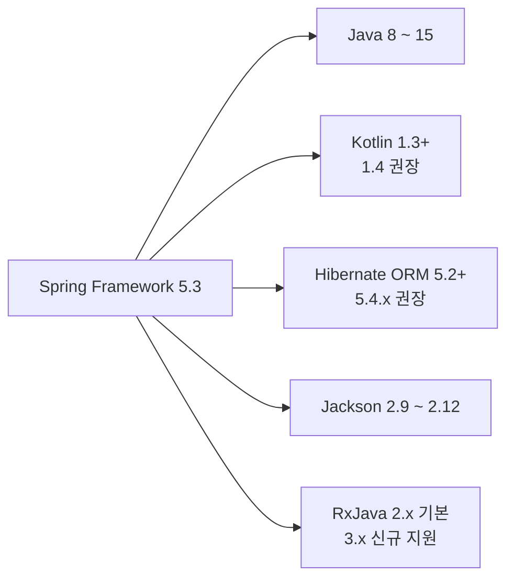
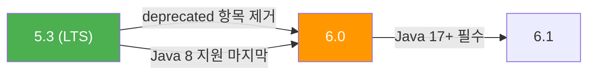

# Spring Framework 5.3 릴리즈 노트

## 1. 개요

Spring Framework 5.3은 **2020년 10월**에 출시된 5.x 시리즈의 **마지막 기능 릴리즈(LTS)**입니다.
URL 매칭 성능을 획기적으로 개선하는 PathPattern 파서, 리액티브 관계형 DB 지원(R2DBC), Java Record 클래스 바인딩, GraalVM 네이티브 이미지 초기 지원 등이 핵심 변경사항입니다.
Spring Boot 2.4 ~ 2.7이 이 버전을 기반으로 하며, OSS 지원은 **2024년 8월 31일**에 종료되었습니다.

---

## 2. 주요 변경사항

### 2.1 PathPattern 파서 — URL 매칭 성능 대폭 향상

기존 `AntPathMatcher` 대비 **6~8배 높은 처리량**, **30~40% 적은 메모리 사용**을 달성하는 새로운 URL 매칭 엔진입니다.
URL 문자열을 미리 파싱(해석)해 둔 뒤, 요청마다 재사용하여 성능을 끌어올립니다.

```yaml
# application.yml — PathPattern 파서 활성화
spring:
  mvc:
    pathmatch:
      matching-strategy: "path-pattern-parser"
```

> **주의:** PathPattern 파서는 경로 중간에 `**`(더블 와일드카드)를 사용할 수 없습니다.
> 예를 들어 `"/api/**/users"`는 허용되지 않고, `"/api/*/users"` 또는 경로 끝에만 `"/api/**"` 형태로 사용해야 합니다.

### 2.2 CORS `allowCredentials` 정책 변경 (Breaking Change)

`allowCredentials=true`를 설정할 때 더 이상 `allowedOrigins("*")`를 사용할 수 없습니다.
반드시 구체적인 도메인을 명시하거나, 새로 추가된 `allowedOriginPatterns`를 사용해야 합니다.

```java
@Configuration
public class WebConfig implements WebMvcConfigurer {

    @Override
    public void addCorsMappings(CorsRegistry registry) {
        registry.addMapping("/api/**")
                // 5.3 이전: allowedOrigins("*") 가능했으나 이제 오류 발생
                .allowedOriginPatterns("https://*.example.com") // 패턴 방식 사용
                .allowCredentials(true);
    }
}
```

### 2.3 `@ExceptionHandler` 원인 체인 전체 탐색 (Breaking Change)

이전에는 최상위 예외만 확인했지만, 5.3부터 예외의 **전체 원인 체인(cause chain)**을 탐색합니다.
따라서 기존에 잡히지 않던 래핑된 예외도 핸들러에 매칭될 수 있습니다.

---

## 3. 새로운 기능

### 3.1 spring-r2dbc 모듈 — 리액티브 관계형 DB 지원

기존에 별도 프로젝트(`spring-data-r2dbc`)에 있던 핵심 기능이 **Spring Framework에 내장**되었습니다.
R2DBC는 JDBC의 리액티브 버전으로, 비동기 + 논블로킹 방식으로 관계형 DB에 접근합니다.

```java
// DatabaseClient를 사용한 리액티브 쿼리
@Repository
public class UserRepository {

    private final DatabaseClient databaseClient;

    public UserRepository(DatabaseClient databaseClient) {
        this.databaseClient = databaseClient;
    }

    public Flux<User> findAll() {
        return databaseClient.sql("SELECT id, name, email FROM users")
                .map(row -> new User(
                        row.get("id", Long.class),
                        row.get("name", String.class),
                        row.get("email", String.class)))
                .all();
    }
}
```

주요 클래스:
- `DatabaseClient` — SQL 실행 및 결과 매핑
- `R2dbcTransactionManager` — 리액티브 트랜잭션 관리

### 3.2 Java 14/15 Record 클래스 지원

Java의 `record` 클래스를 데이터 바인딩에 사용할 수 있습니다.
`DataClassRowMapper`가 생성자 기반 바인딩을 지원하여 Record, Kotlin Data Class, Lombok Data Class 모두 활용 가능합니다.

```java
// record 클래스 정의 (Java 14+)
// record는 불변(immutable) 데이터를 담는 간결한 클래스입니다
public record UserDto(String name, String email, int age) {}

// JdbcTemplate에서 record 클래스 직접 매핑
List<UserDto> users = jdbcTemplate.query(
        "SELECT name, email, age FROM users",
        new DataClassRowMapper<>(UserDto.class)
);
```

### 3.3 향상된 Cron 표현식

Quartz 스타일의 확장 표현식을 지원합니다.

| 기호 | 의미 | 예제 |
|------|------|------|
| `L` | 마지막(Last) | `0 0 0 L * ?` — 매월 마지막 날 자정 |
| `nW` | n일에 가장 가까운 평일(Weekday) | `0 0 0 15W * ?` — 15일에 가장 가까운 평일 |
| `#` | n번째 요일 | `0 0 0 ? * 5#3` — 매월 세 번째 목요일 |

```java
// 매월 마지막 날 자정에 실행
@Scheduled(cron = "0 0 0 L * ?")
public void monthlyReport() {
    // 월말 정산 로직
}

// 매월 세 번째 금요일 오전 9시에 실행
@Scheduled(cron = "0 0 9 ? * 6#3")
public void biweeklyMeeting() {
    // 격주 미팅 알림
}
```

### 3.4 WebTestClient의 MockMvc 지원 — 통합 테스트 API

WebFlux용으로 설계된 `WebTestClient`를 **Spring MVC 테스트에서도** 사용할 수 있게 되었습니다.
서블릿 기반과 리액티브 기반을 하나의 테스트 API로 통합할 수 있습니다.

```java
@SpringBootTest
@AutoConfigureMockMvc
class UserControllerTest {

    @Autowired
    private MockMvc mockMvc;

    @Test
    void shouldReturnUser() {
        // MockMvc를 WebTestClient로 감싸서 사용
        WebTestClient client = MockMvcWebTestClient.bindTo(mockMvc).build();

        client.get().uri("/api/users/1")
                .exchange()
                .expectStatus().isOk()
                .expectBody()
                .jsonPath("$.name").isEqualTo("홍길동");
    }
}
```

### 3.5 GraalVM 네이티브 이미지 초기 지원

GraalVM으로 네이티브 이미지를 빌드할 때 불필요한 기능을 끄는 설정이 추가되었습니다.
이는 Spring Framework 6.0의 본격적인 네이티브 지원을 위한 **기초 작업**입니다.

```properties
# application.properties — GraalVM 네이티브 이미지 최적화
spring.xml.ignore=true       # XML 설정 파싱 비활성화
spring.spel.ignore=true      # SpEL(Spring Expression Language) 평가 비활성화
```

### 3.6 JdbcTemplate.queryForStream() — 지연 스트림 조회

대량 데이터를 한 번에 메모리에 올리지 않고 **지연(lazy) 방식**으로 처리할 수 있습니다.

```java
// 대량 데이터를 스트림으로 처리 (메모리 효율적)
try (Stream<User> stream = jdbcTemplate.queryForStream(
        "SELECT * FROM users",
        new DataClassRowMapper<>(User.class))) {

    List<String> activeEmails = stream
            .filter(user -> user.age() >= 18)
            .map(User::email)
            .toList();
}
// try-with-resources로 반드시 스트림을 닫아야 합니다
```

---

## 4. 개선사항

### 4.1 코어 컨테이너

- `ObjectProvider.ifAvailable/ifUnique`가 비활성 스코프의 빈(Bean)을 무시하도록 개선
- `@EventListener` 메서드가 기본적으로 `Ordered.LOWEST_PRECEDENCE` 우선순위를 가짐
- `DataBinder`에서 필드 접근과 프로퍼티 접근을 전환할 수 있도록 개선

### 4.2 웹 계층

- `RequestEntity`가 URI 템플릿과 변수를 지원
- Spring MVC에서 `.*` 접미사(suffix) 패턴 매칭이 **기본 비활성화**
- `@RequestParam` / `@RequestHeader`에서 null 변환 결과를 누락 값(missing)으로 처리

### 4.3 WebFlux

- `DefaultPartHttpMessageReader`로 완전한 리액티브 멀티파트 처리 지원
- `WebClient`용 Apache HttpComponents 커넥터 추가
- Netty `ByteBuf` 전용 `Encoder` / `Decoder` 구현체 추가

### 4.4 데이터 접근

- `JdbcTransactionManager`가 커밋 시 데이터 접근 예외 변환(translation) 지원
- `TransactionSynchronization`이 `Ordered` 인터페이스를 확장하여 실행 순서 제어 가능

### 4.5 테스트

- JUnit Jupiter의 `@Nested` 클래스에서 테스트 어노테이션이 **기본 상속**
- `@Transactional(propagation = NEVER)` 설정으로 테스트 관리 트랜잭션 비활성화 가능
- REST 클라이언트 테스트용 멀티파트 데이터 매처(matcher) 개선

### 4.6 RxJava 3.x 신규 지원

RxJava 3.x를 새로 지원합니다. RxJava 1.x는 deprecated 되었습니다.

---

## 5. 폐기(Deprecated) 및 제거(Removed) 항목

### Deprecated (향후 제거 예정)

| 항목 | 설명 |
|------|------|
| **RxJava 1.x** | 2.x가 기본, 3.x 신규 지원. 1.x는 6.0에서 제거 |
| **원격 호출 기술들** | Hessian, RMI, HTTP Invoker, JMS Invoker — 모두 6.0에서 제거 |
| **JCA CCI 지원** | Java Connector Architecture의 Common Client Interface 지원 폐기 |
| **Properties 기반 빈 정의** | XML이나 Java Config 사용을 권장 |
| **`InstantiationAwareBeanPostProcessorAdapter`** | 인터페이스를 직접 구현하도록 변경 |
| **`JdbcTemplate`의 `Object[]` 파라미터 메서드** | 가변 인자(varargs) 메서드 사용을 권장 |

> **참고:** Deprecated 항목 대부분은 Spring Framework **6.0에서 완전히 제거**됩니다.

---

## 6. 호환성

### 최소 요구사항



| 항목 | 버전 |
|------|------|
| **Java** | 8, 11, 15 (LTS 기준 8과 11 권장) |
| **Kotlin** | 1.3+ (1.4 권장), Coroutines 1.4+ 필요 |
| **Hibernate ORM** | 5.2+ (5.4.x 권장) |
| **Jackson** | 2.9 ~ 2.12 |
| **Groovy** | 3.0 공식 지원, 2.x 단계적 축소 |
| **RxJava** | 2.x 기본, 3.x 신규 지원 |

### Spring Boot 호환

| Spring Boot | Spring Framework |
|-------------|------------------|
| 2.4.x | 5.3.x |
| 2.5.x | 5.3.x |
| 2.6.x | 5.3.x |
| 2.7.x | 5.3.x |

### LTS로서의 의미

Spring Framework 5.3은 5.x 시리즈의 **마지막 기능 릴리즈**입니다.
6.0으로의 마이그레이션을 위한 **다리 역할**을 하며, 5.3에서 deprecated된 항목들이 6.0에서 제거됩니다.



---

## 7. 참고 자료

- [Spring Framework 5.3 릴리즈 노트 (GitHub Wiki)](https://github.com/spring-projects/spring-framework/wiki/Spring-Framework-5.3-Release-Notes)
- [What's New in Spring Framework 5.x (GitHub Wiki)](https://github.com/spring-projects/spring-framework/wiki/What%27s-New-in-Spring-Framework-5.x)
- [Spring Framework 5.3 Goes GA (공식 블로그)](https://spring.io/blog/2020/10/27/spring-framework-5-3-goes-ga)
- [Spring Framework GitHub Repository](https://github.com/spring-projects/spring-framework)
- [Spring Boot 2.4 릴리즈 노트](../spring-boot/2.x/2.4.md)
