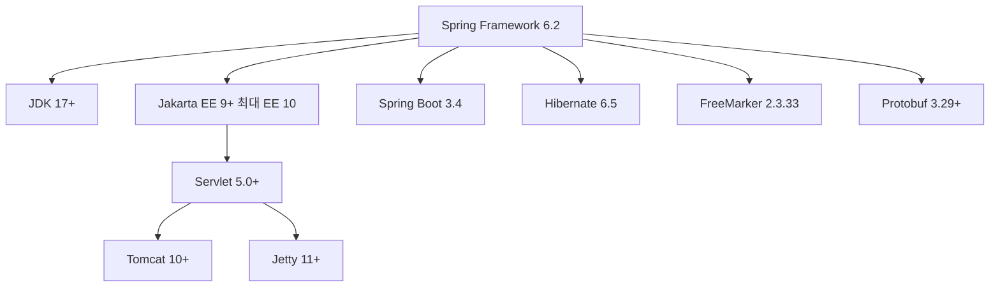

# Spring Framework 6.2 릴리즈 노트

Spring Framework 6.2는 2024년 11월에 릴리즈되었으며, `@Fallback` 빈, 빈 오버라이딩 제어, 백그라운드 빈 초기화, 테스트 어노테이션 개편 등 개발 편의성과 성능을 크게 향상시킨 버전입니다. Spring Boot 3.4의 기반 프레임워크입니다.

---

## 주요 변경사항

### 기본 요구사항

| 항목 | 요구사항 |
|:---:|:---:|
| **Java** | 17+ (JDK 17, 21, 25 테스트 완료) |
| **Jakarta EE** | 9+ (최대 EE 10) |
| **Servlet** | 5.0+ (Tomcat 10+, Jetty 11+) |

### @Fallback 빈

새로운 `@Fallback` 어노테이션을 사용하면 **기본 구현체**를 제공할 수 있습니다. 사용자가 같은 타입의 빈을 직접 등록하면 `@Fallback` 빈은 자동으로 무시되고, 등록하지 않으면 `@Fallback` 빈이 사용됩니다.

```java
// 기본 구현체 - 사용자가 직접 빈을 등록하지 않으면 이 빈이 사용됨
@Configuration
public class DefaultConfig {

    @Bean
    @Fallback
    public NotificationService defaultNotificationService() {
        return new EmailNotificationService(); // 기본: 이메일 알림
    }
}

// 사용자 설정 - 이 빈이 등록되면 @Fallback 빈은 무시됨
@Configuration
public class CustomConfig {

    @Bean
    public NotificationService customNotificationService() {
        return new SlackNotificationService(); // 커스텀: Slack 알림
    }
}
```

> **쉽게 말하면:** "기본값을 정해두되, 사용자가 원하면 자유롭게 교체할 수 있게 하는" 패턴입니다. 라이브러리나 자동 설정(Auto-configuration)을 만들 때 유용합니다.

### 빈 오버라이딩 제어 강화

이전에는 같은 이름의 빈이 여러 개 등록되면 조용히 덮어쓰기 되어 디버깅이 어려웠습니다. 6.2부터는 빈 오버라이딩이 **INFO 레벨로 로그에 기록**됩니다. 또한 다음과 같은 잘못된 설정을 거부합니다:

- 반환 타입이 `void`인 `@Bean` 메서드
- `@Bean`과 `@Autowired`가 동시에 붙은 메서드

### 백그라운드 빈 초기화

초기화에 시간이 오래 걸리는 빈을 **백그라운드 스레드에서 병렬로 초기화**할 수 있습니다. 이를 통해 애플리케이션 시작 시간을 단축할 수 있습니다.

```java
@Configuration
public class AppConfig {

    // 이 빈은 백그라운드에서 초기화됨 (시작 시간 단축)
    @Bean(bootstrap = Bean.Bootstrap.BACKGROUND)
    public ExpensiveService expensiveService() {
        // DB 연결, 캐시 워밍업 등 시간이 걸리는 작업
        return new ExpensiveService();
    }
}
```

> **주의:** 백그라운드 초기화는 유연한 잠금(lenient locking) 전략을 사용하고, 일반 부트스트랩은 엄격한 잠금(strict locking)을 사용합니다. 이전 동작을 복원하려면 시스템 속성 `spring.locking.strict=true`를 설정하면 됩니다.

### 유연한 잠금 (Lenient Locking)

Spring 컨테이너의 내부 잠금 전략이 개선되어 **가상 스레드(Virtual Threads)**와의 호환성이 향상되었습니다. 백그라운드 초기화 시에는 유연한 잠금을 적용하여 가상 스레드 환경에서도 교착 상태(deadlock) 없이 빈을 초기화할 수 있습니다.

---

## 새로운 기능

### 테스트 어노테이션 개편

Spring Boot에서 사용하던 `@MockBean`과 `@SpyBean`이 Spring Framework 6.2로 통합되었습니다. 기존 어노테이션은 폐기 예정이며, 새 어노테이션으로 전환이 권장됩니다.

| 기존 (Spring Boot) | 신규 (Spring Framework 6.2) | 설명 |
|:---:|:---:|:---:|
| `@MockBean` | `@MockitoBean` | Mockito 목(mock) 객체로 빈 교체 |
| `@SpyBean` | `@MockitoSpyBean` | Mockito 스파이(spy) 객체로 빈 감싸기 |
| _(없음)_ | `@TestBean` | 테스트 전용 빈 정의로 프로덕션 빈 교체 |

```java
@SpringBootTest
class OrderServiceTest {

    // Mockito 목 객체로 빈을 교체
    @MockitoBean
    private PaymentGateway paymentGateway;

    // Mockito 스파이 객체로 빈을 감싸기
    @MockitoSpyBean
    private OrderRepository orderRepository;

    // 팩토리 메서드를 통한 테스트 전용 빈 교체
    @TestBean
    private NotificationService notificationService;

    static NotificationService notificationService() {
        // @TestBean은 같은 이름의 static 메서드를 팩토리로 사용
        return new FakeNotificationService();
    }

    @Test
    void 주문_생성_테스트() {
        given(paymentGateway.charge(any())).willReturn(true);

        // 테스트 코드 작성...
    }
}
```

> **@MockitoBeanSettings**: 엄격한 스터빙(strict stubbing) 모드를 설정할 수 있어 불필요한 목 설정을 방지합니다.

### UrlHandlerFilter

Spring Framework 6.1부터 URL 끝의 슬래시(`/path/`)를 자동으로 매칭하지 않게 변경되었습니다. 6.2에서는 `UrlHandlerFilter`를 통해 이 전환을 **부드럽게 처리**할 수 있습니다.

```java
@Configuration
public class WebConfig {

    @Bean
    public FilterRegistrationBean<UrlHandlerFilter> urlHandlerFilter() {
        // "/path/"로 들어오는 요청을 "/path"로 리다이렉트
        UrlHandlerFilter filter = UrlHandlerFilter
            .trailingSlashHandler("/api/**")
            .redirect(HttpStatus.PERMANENT_REDIRECT) // 308 리다이렉트
            .build();

        return new FilterRegistrationBean<>(filter);
    }
}
```

- **redirect**: 클라이언트에게 올바른 URL로 리다이렉트 응답을 보냄
- **rewrite**: 서버 내부에서 URL을 변환하여 클라이언트는 변경을 인식하지 못함

### SpEL IndexAccessor

SpEL(Spring Expression Language)에서 **커스텀 인덱싱 접근**을 지원합니다. `IndexAccessor`와 `CompilableIndexAccessor` SPI를 통해 사용자 정의 자료구조에 대한 인덱스 접근이 가능합니다.

```java
// SpEL에서 안전한 탐색(safe navigation)이 인덱스에도 적용
// myList?.[0] - myList가 null이면 null 반환, 아니면 첫 번째 요소 반환
```

내장 `ReflectiveIndexAccessor` 구현체가 제공되며, 배열, 컬렉션, 문자열, Map 등에서 안전한 탐색(`?.[]`)을 사용할 수 있습니다.

### @DurationFormat 및 @Scheduled 개선

사람이 읽기 쉬운 시간 표현 형식을 지원합니다.

```java
@Component
public class CacheConfig {

    // "30s" = 30초, "2h30m" = 2시간 30분
    @DurationFormat(style = DurationFormat.Style.SIMPLE)
    @Value("${cache.ttl:30s}")
    private Duration cacheTtl;
}

@Component
public class ScheduledTasks {

    // 기존: fixedRate = 60000 (밀리초로 써야 해서 읽기 어려움)
    // 6.2: fixedRate = "1m" 또는 "30s" 형식 지원
    @Scheduled(fixedRate = "1m")
    public void 주기적_작업() {
        // 1분마다 실행
    }
}
```

### 생성자 바인딩 확장 (List, Map, 배열)

`@ModelAttribute`의 생성자 바인딩이 **List, Map, 배열** 파라미터를 지원합니다. 기존에는 setter 기반 바인딩에서만 가능했던 것이 이제 불변 객체에서도 사용 가능합니다.

```java
// 생성자 바인딩으로 불변 객체 생성 (List, Map도 지원)
public record SearchCriteria(
    String keyword,
    List<String> categories,    // ?categories=java&categories=spring
    Map<String, String> filters // ?filters[sort]=date&filters[order]=desc
) { }

@GetMapping("/search")
public List<Item> search(@ModelAttribute SearchCriteria criteria) {
    return itemService.search(criteria);
}
```

### AssertJ 기반 MockMvc 지원

새로운 `MvcTester` 클래스를 통해 MockMvc 테스트에서 **AssertJ 스타일의 유창한 검증**이 가능합니다.

```java
// 기존 MockMvc 스타일
mockMvc.perform(get("/api/users"))
    .andExpect(status().isOk())
    .andExpect(jsonPath("$.length()").value(3));

// 6.2 MvcTester 스타일 (AssertJ 기반)
assertThat(mvc.perform(get("/api/users")))
    .hasStatusOk()
    .body().json().isLenientlyEqualTo(expectedJson);
```

### 기타 새로운 기능

- **프래그먼트 렌더링**: 하나의 요청에서 여러 뷰를 렌더링 가능 (htmx, Turbo 통합 지원)
- **@ExceptionHandler 콘텐츠 협상**: `produces` 속성으로 API(JSON)와 브라우저(HTML) 응답 구분
- **Property Placeholder 이스케이프**: `\${key}`로 리터럴 `${key}` 출력 가능
- **URL 파싱 개선**: RFC 3986 및 WHATWG 표준 기반 파서 도입
- **Partitioned Cookie 지원**: 리액티브 웹 서버에서 CHIPS "Partitioned" 속성 지원
- **@RegisterReflection / @ReflectionScan**: GraalVM 네이티브 이미지용 리플렉션 힌트 간소화
- **동적 속성 등록**: 테스트에서 `DynamicPropertyRegistrar` 빈으로 동적 속성 등록 가능

---

## 개선사항

| 영역 | 개선 내용 |
|------|----------|
| **자동 와이어링 알고리즘** | 파라미터 이름과 `@Qualifier`가 `@Priority`보다 우선 적용 |
| **스케줄링** | `TaskDecorator`가 스케줄 태스크에도 적용, 실행 메타데이터 노출 |
| **정적 리소스** | 문자열로 설정된 정적 리소스 경로에 자동으로 후행 슬래시 추가 |
| **HtmlUnit** | 4.2+로 업그레이드 (셀레니움 드라이버 좌표 변경) |
| **RestClient** | `retrieve()` 후 반드시 `.toBodilessEntity()` 등 터미널 연산 호출 필요 |

---

## 폐기(Deprecated) 및 제거(Removed) 항목

### 제거됨

| 항목 | 대안 |
|------|------|
| `Base64Utils` | `java.util.Base64` 사용 |
| `AbstractClientHttpResponse` | 구체 구현체 사용 |
| `getRawStatusCode()` | `getStatusCode()` 사용 |
| 기타 6.0/6.1에서 deprecated 처리된 API들 | 각 Javadoc 참조 |

### 주의 사항

- **RestClient 동작 변경**: `restClient.get().uri("/path").retrieve()`만 호출하고 터미널 연산(`.toBodilessEntity()`, `.body()` 등)을 호출하지 않으면 요청이 실행되지 않습니다(no-op).

---

## 호환성



### Spring 포트폴리오 호환

- Spring Boot 3.4
- Spring Security 6.4
- JDK: 17, 21, 25 테스트 완료

---

## 참고 자료

- [Spring Framework 6.2 Release Notes (GitHub Wiki)](https://github.com/spring-projects/spring-framework/wiki/Spring-Framework-6.2-Release-Notes)
- [What's New in Spring Framework 6.x (GitHub Wiki)](https://github.com/spring-projects/spring-framework/wiki/What's-New-in-Spring-Framework-6.x)
- [Spring Boot 3.4 Release Notes (GitHub Wiki)](https://github.com/spring-projects/spring-boot/wiki/Spring-Boot-3.4-Release-Notes)
