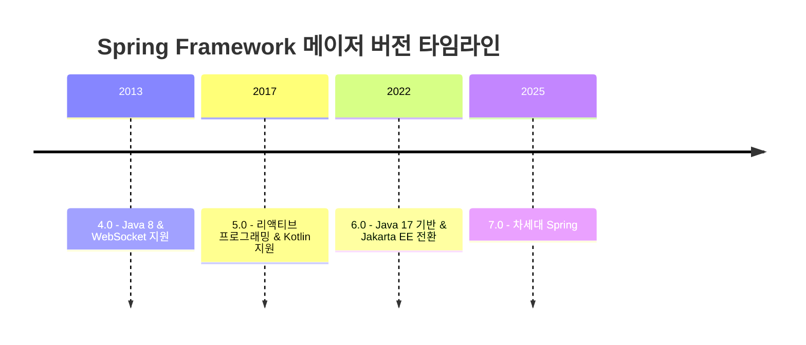

# Spring Framework 버전 히스토리

Spring Framework는 2003년에 처음 릴리즈된 이래, Java 엔터프라이즈 애플리케이션 개발의 사실상 표준 프레임워크로 자리잡았습니다.
이 문서에서는 4.x부터 7.x까지의 주요 버전을 다룹니다.

---

## 버전 타임라인

---

## 호환성 매트릭스

| Spring Framework | 최소 Java | Servlet API | Jakarta EE | 릴리즈 |
|:---:|:---:|:---:|:---:|:---:|
| **4.0** | Java 6 | 3.0+ | - | 2013-12 |
| **4.1** | Java 6 | 3.0+ | - | 2014-09 |
| **4.2** | Java 6 | 2.5+ | - | 2015-07 |
| **4.3** | Java 6 | 2.5+ | - | 2016-06 |
| **5.0** | Java 8 | 3.1+ | - | 2017-09 |
| **5.1** | Java 8 | 3.1+ | - | 2018-09 |
| **5.2** | Java 8 | 3.1+ | - | 2019-09 |
| **5.3** | Java 8 | 3.1+ | - | 2020-10 |
| **6.0** | Java 17 | 5.0+ | 9+ | 2022-11 |
| **6.1** | Java 17 | 5.0+ | 9+ | 2023-11 |
| **6.2** | Java 17 | 5.0+ | 9+ | 2024-11 |
| **7.0** | Java 17 | 6.1+ | 11 | 2025-11 |

> **용어 설명:**
> - **Servlet API**: 웹 애플리케이션을 처리하는 Java 표준 인터페이스
> - **Jakarta EE**: 기존 Java EE가 이름을 바꾼 것 (패키지명 `javax.*` → `jakarta.*`)
> - **EOL**: End of Life, 더 이상 보안 패치를 받지 못하는 상태

---

## 메이저 버전별 핵심 테마

### [4.x 시리즈](4.x/) — Java 8과 현대화의 시작
Spring 4는 Java 8의 람다(Lambda)와 스트림(Stream) API를 지원하고, WebSocket 통신을 도입한 버전입니다.
- [4.0](4.x/4.0.md) | [4.1](4.x/4.1.md) | [4.2](4.x/4.2.md) | [4.3](4.x/4.3.md)

### [5.x 시리즈](5.x/) — 리액티브 혁명
Spring 5는 리액티브 프로그래밍(Reactive Programming)을 핵심으로 도입하고, Kotlin을 공식 지원한 버전입니다.
Spring WebFlux가 이 시리즈에서 탄생했습니다.
- [5.0](5.x/5.0.md) | [5.1](5.x/5.1.md) | [5.2](5.x/5.2.md) | [5.3](5.x/5.3.md)

### [6.x 시리즈](6.x/) — Jakarta EE 전환과 AOT
Spring 6는 Java 17을 최소 요구사항으로 올리고, `javax.*` → `jakarta.*` 패키지 전환을 단행한 대격변 버전입니다.
AOT(Ahead-of-Time) 컴파일과 GraalVM 네이티브 이미지를 본격 지원합니다.
- [6.0](6.x/6.0.md) | [6.1](6.x/6.1.md) | [6.2](6.x/6.2.md)

### [7.x 시리즈](7.x/) — 차세대 Spring
Spring 7은 가상 스레드(Virtual Threads) 등 최신 Java 기능을 적극 활용하는 차세대 버전입니다.
- [7.0](7.x/7.0.md)

---

## 마이그레이션 가이드

메이저 버전 업그레이드가 필요하다면 아래 가이드를 참고하세요:
- [4.x → 5.x 마이그레이션](../migration-guides/spring-framework-4to5.md)
- [5.x → 6.x 마이그레이션](../migration-guides/spring-framework-5to6.md)
- [6.x → 7.x 마이그레이션](../migration-guides/spring-framework-6to7.md)

---

## 참고 자료
- [Spring Framework 공식 GitHub](https://github.com/spring-projects/spring-framework)
- [Spring Framework 공식 문서](https://docs.spring.io/spring-framework/reference/)
- [Spring 블로그](https://spring.io/blog)
